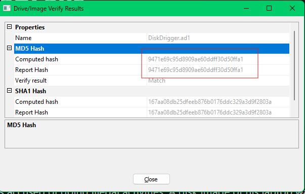
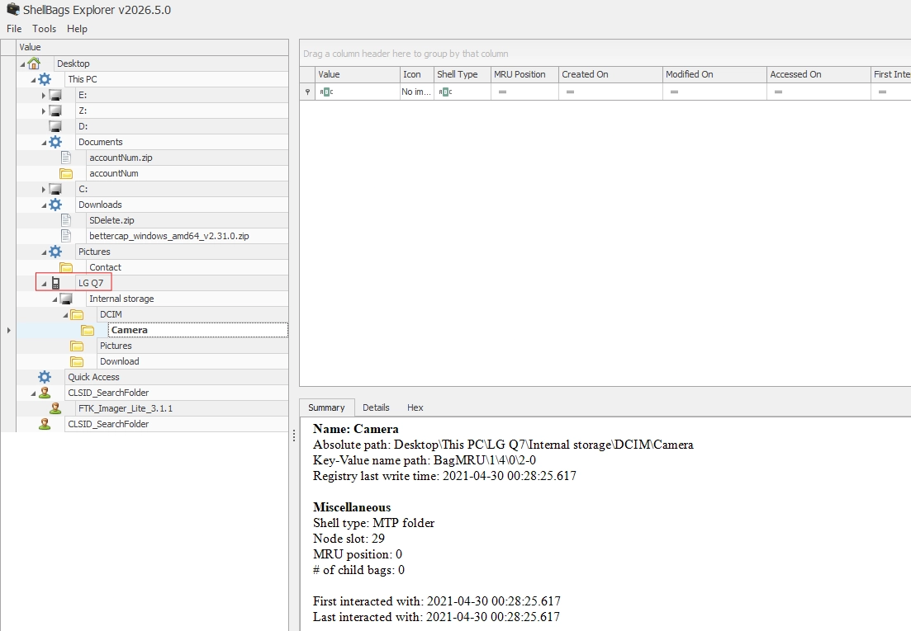

# AfricanFalls

#### Scenario

John Doe was accused of doing illegal activities. A disk image of his laptop was taken. Your task as a soc analyst is to analyze the image and understand what happened under the hood.

> *Q1: What is the MD5 hash value of the suspect disk?*
> 



`9471e69c95d8909ae60ddff30d50ffa1`

> *Q2: What phrase did the suspect search for on 2021-04-29 18:17:38 UTC? (three words, two spaces in between)*
> 
- sử dụng phần mềm BrowsingHistoryView để đọc file history của trình duyệt Chrome (Users\John Doe\AppData\Local\Google\Chrome\User Data\Default\History)


- mình tìm được user đã dùng gg search để tìm kiếm cụm từ `password cracking lists`

> *Q3: What is the IPv4 address of the FTP server the suspect connected to?*
> 
- mình thấy trên máy có phần mềm FileZilla dùng để truyền file dựa trên giao thức FTP


- mình sẽ tìm đến file recentservers.xml lưu nhật ký kết nối mạng


`192.168.1.20`

> *Q4: What date and time was a password list deleted in UTC? (YYYY-MM-DD HH:MM:SS UTC)*
> 


- trong recycle bin của user 1001 có file này bị xóa, file $I là file chứa tên của file bị xóa, $R là file chứa nội dung của file bị xóa. Time của file $I sẽ chứa thời gian file đó bị xóa vì khi xóa thì file $I mới được tạo ra, còn file $R vẫn lưu thời gian từ lúc file gốc được tạo ra.

`2021-04-29 18:22`

> *Q5: How many times was Tor Browser ran on the suspect's computer? (number only)*
> 


- tìm đến arifact Prefetch, file này có thể chứa số lần một chương chình được chạy và time của 8 lần chạy gần nhất.
- mình chỉ tìm thấy file [TORBROWSER-INSTALL-WIN64-10.0-F3C4DF19.pf](http://TORBROWSER-INSTALL-WIN64-10.0-F3C4DF19.pf) là liên quan đến trình duyệt TOR, đây là file để install trình duyệt này.
- file này chỉ được chạy 1 lần mà lại không có file thực thi để chạy trình duyệt (như Tobrowser.exe), chứng tỏ người dùng mới chỉ install file này về mà chưa chạy trình duyệt này lần nào.

`0`

> *Q6: What is the suspect's email address?*
> 


- mình tìm thấy trong history của chrome có lịch sử đăng nhập vào ProtonMail

`dreammaker82@protonmail.com`

> Q7: What is the FQDN did the suspect port scan?
> 
- quét port thì mình nghĩ tới việc suspect đã sử dụng nmap để quét, và mình tìm thử lịch sử các lệnh của powershell
- \AppData\Roaming\Microsoft\Windows\PowerShell\PSReadLine\ConsoleHost_history.txt


- suspect đã sử dụng nmap để quét port vào domain `dfir.science`

> *Q8: What country was picture "20210429_152043.jpg" allegedly taken in?*
> 


- export file ảnh này về và kiểm tra metadata để trích xuất ra tọa độ gps của ảnh


- cách 2 là dùng trang web này để trích xuất ra gps của ảnh và tự xác định ra vị trí của gps đó trên bản đồ luôn.

[https://www.pic2map.com/photos-jderop.html](https://www.pic2map.com/photos-jderop.html)

`Zambia`

> *Q9: What is the parent folder name picture "20210429_151535.jpg" was in before the suspect copy it to "contact" folder on his desktop?*
> 
- kiểm tra metadata của ảnh thì mình thấy nó được chụp từ một thiết bị điện tử LG


- user có thể đã cắm thiết bị này vào máy rồi copy ảnh này từ thiết bị đó ra. Điều này khiến mình phải tìm đến Shellbag, nơi chứa những thông tin mà user đã truy cập vào folder và file nào trên Explorer.
- mình sử dụng ShellBags Explorer để trích xuất shellbag từ userclass.dat




- mình thấy có thiết bị LG Q7 được kết nối với máy tính, trong đó có thư mục LG Q7\Internal storage\DCIM\Camera thường chứa những ảnh mà máy ảnh kia chụp được. User đã copy ảnh từ thư mục này sang thư mục Contact trên windows.

`Camera`

> *Q10: A Windows password hashes for an account are below. What is the user's password? Anon:1001:aad3b435b51404eeaad3b435b51404ee:3DE1A36F6DDB8E036DFD75E8E20C4AF4:::*
> 


`AFR1CA!`

> *Q11: What is the user "John Doe's" Windows login password?*
> 
- để lấy được password hash của các user thì mình phải dump vào file SAM, cùng với đó là file SYSTEM để trích ra key giải mã file SAM.
- trên windows có thể dùng mimikatz để dump, nhưng trên kali nên mình dùng impacket-secretsdump
    
    ```jsx
    impacket-secretsdump -sam SAM -system SYSTEM local
    ```
    


`ctf2021`