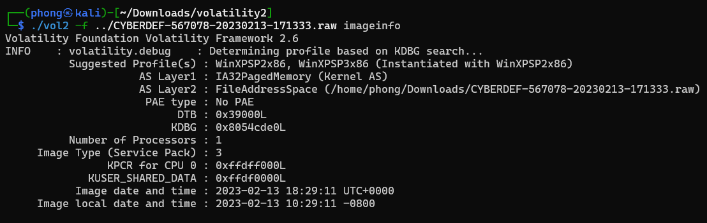

# BlackEnergy

#### Scenario

A multinational corporation has suffered a cyber attack, resulting in the theft of sensitive data. The attack employed a previously unseen variant of the BlackEnergy v2 malware. The company's security team has obtained a memory dump from the infected machine and is seeking your expertise as a SOC analyst to analyze the dump in order to understand the scope and impact of the attack.

> *Q1: Which volatility profile would be best for this machine?*
> 

```jsx
 ./vol2 -f ../CYBERDEF-567078-20230213-171333.raw imageinfo
```



`WinXPSP2x86`

> *Q2: How many processes were running when the image was acquired?*
> 

```jsx
./vol2 -f ../CYBERDEF-567078-20230213-171333.raw pslist
```


- câu hỏi chỉ hỏi những process đang chạy nên đáp án là `19`

> *Q3: What is the process ID of **`cmd.exe`**?*
> 


`1960`

> *Q4: What is the name of the most suspicious process?*
> 

`rootkit.exe` 

> *Q5: Which process shows the highest likelihood of code injection?*
> 
- sử dụng plugin malfind

```jsx
./vol2 -f ../CYBERDEF-567078-20230213-171333.raw malfind
```


- mình thấy process svchost.exe có Protection memory là RWX, PrivateMemory: 1 nghĩa là một vùng nhớ private nhưng lại là một file .exe (vì header là MZ).
- một file .exe thường nằm ở ngay đầu của Virtual Address Space của một tiến trình trên RAM, nên nó không thể nằm trong vùng Private Memory được.

`svchost.exe`

> *Q6: There is an odd file referenced in the recent process. Provide the full path of that file.*
> 

```jsx
./vol2 -f ../CYBERDEF-567078-20230213-171333.raw handles -p 880 -t file
```

- handles là plugin để liệt kê tất cả các handles mà process đang nắm giữ, t- file là tham số để liệt kê chỉ những handles là tệp tin.


- str.sys là driver ko tồn tại trên hệ thống.

`str.sys` 

> *Q7: What is the name of the injected DLL file loaded from the recent process?*
> 

```jsx
 ./vol2 -f ../CYBERDEF-567078-20230213-171333.raw ldrmodules -p 880
```

- ldrmodules (loader modules) là plugin liệt kê các module được load của một tiến trình.


- Windows loader sẽ dữ 3 danh sách liên kết trong PEB để theo dõi các module/dll được nạp vào process
    - InLoadOrderModuleList: list sắp các module theo thứ tự được load vào process.
    - InMemoryOrderModuleList: list sắp các module theo thứ tự địa chỉ base trong memory.
    - InInitializationOrderModuleList: list sắp các module theo thực tự được khởi tạo.
- mình thấy cả 3 trường này của msxml3r.dll đều là false, có nghĩ vol tìm thấy module này trong mem nhưng không có trong 3 danh sách kia, có thể attacker đã xóa chúng khỏi 3 danh sách kia để denfense evasion.

`msxml3r.dll`

> *Q8: What is the base address of the injected DLL?*
> 
- kết quả của plugin malfind tìm được ở trên chỉ ra một vùng nhớ của svchost.exe là độc hại (vì nó có protection memory là RWX, nằm trong vùng private, và là file thực thi)


- đây có thể là file msxml3r.dll bị tiêm mình tìm được ở câu trên, và base address của nó là `0x980000`
- còn address nằm trong lệnh ldrmodules ở câu trên có thể đã bị attacker chỉnh sửa.