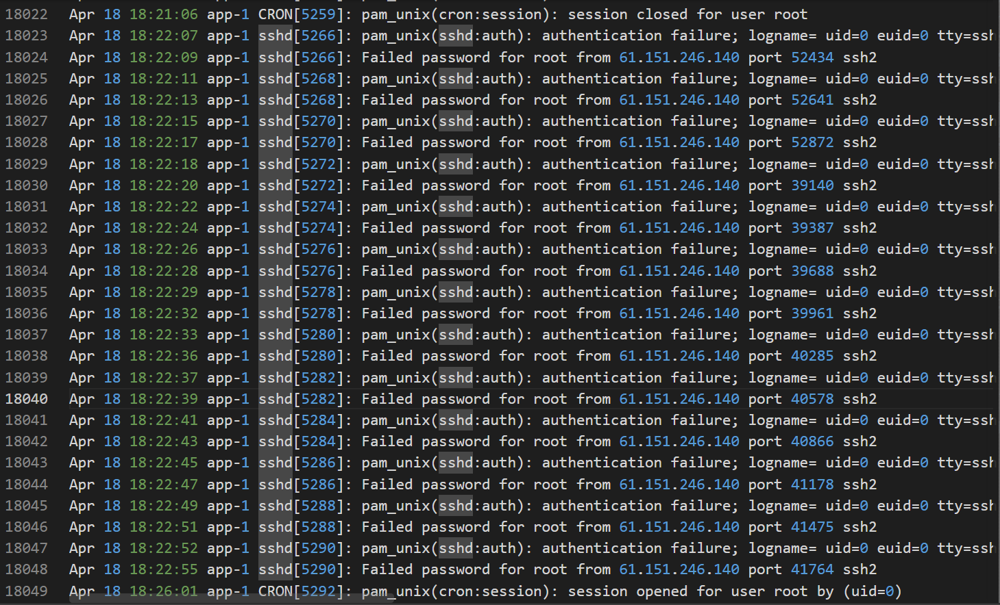

# Hammered

#### Scenario

This challenge takes you into virtual systems and confusing log data. In this challenge, as a SOC Analyst figure out what happened to this webserver honeypot using the logs from a possibly compromised server.

> *Q1: Which service did the attackers use to gain access to the system?*
> 



- brute force dịch vụ ssh

`ssh` 

> *Q2: What is the operating system version of the targeted system?*
> 
- mình tìm trong kern.log
    
    ```jsx
    Mar 18 09:41:44 app-1 kernel: [    0.000000] Linux version 2.6.24-26-server (buildd@crested) (gcc version 4.2.4 (Ubuntu 4.2.4-1ubuntu3)) #1 SMP Tue Dec 1 18:26:43 UTC 2009 (Ubuntu 2.6.24-26.64-server)
    ```
    

`4.2.4-1ubuntu3`

> *Q3: What is the name of the compromised account?*
> 


- mình tìm được những user này với số lần bị đăng nhập thất bại, user root bị brute force khá nhiều
- mình kiểm tra tiếp thì thấy user root đã được accepted password từ nhiều ip của attacker


`root` 

> *Q4: How many attackers, represented by unique IP addresses, were able to successfully access the system after initial failed attempts?*
> 
- lọc ra các ip đăng nhập thất bại với số lượng của nó
    
    ```jsx
    grep "Failed password" auth.log | awk '{for(i=1;i<=NF;i++) if($i=="from") print $(i+1)}' | sort | uniq -c
    ```
    


- tiếp theo mình lọc ra các ip đăng nhập thành công
    
    ```jsx
    grep "Accepted password" auth.log | awk '{for(i=1;i<=NF;i++) if($i=="from") print $(i+1)}' | sort | uniq -c
    ```
    


- nhiều quá nên mình sẽ ghép những ip vừa đăng nhập thành công và đăng nhập thất bại ở trên lại rồi so sánh xem ip nào với số lần đăng nhập thất bại nhiều mà vẫn có lần đăng nhập thành công.
    
    ```jsx
    comm -12 <(grep "Failed password for root" auth.log | awk '{for(i=1;i<=NF;i++) if($i=="from") print $(i+1)}' | sort | uniq) <(grep "Accepted password for root" auth.log | awk '{for(i=1;i<=NF;i++) if($i=="from") print $(i+1)}' | sort | uniq)
    ```
    


- sau khi loại bỏ đi ip private và những ip ko đăng nhập thất bại thì mình thu được tổng là 6 ip của attacker đã đăng nhập thành công.

`6` 

> *Q5: Which attacker's IP address successfully logged into the system the most number of times?*
> 


- trong số các ip của attacker đăng nhập thành công thì ip này là đăng nhập nhiều nhất với 4 lần.

`219.150.161.20`

> *Q6: How many requests were sent to the Apache Server?*
> 


`365`

> *Q7: How many rules have been added to the firewall?*
> 


`6`

> *Q8: One of the downloaded files on the target system is a scanning tool. What is the name of the tool?*
> 


`nmap`

> *Q9: When was the last login from the attacker with IP 219.150.161.20?*
> 


- log này ko có năm nên mình tìm thử năm trong fsck


> *Q10: The database showed two warning messages. Please provide the most critical and potentially dangerous one.*
> 


`mysql.user contains 2 root accounts without password!`

> *Q11: Multiple accounts were created on the target system. Which account was created on **April 26** at **04:43:15**?*
> 


`wind3str0y`

> *Q12: Few attackers were using a proxy to run their scans. What is the corresponding user-agent used by this proxy?*
> 
- mình lọc ra trường user agent trong access.log
    
    ```jsx
    awk '{print $12}' apache2/www-access.log
    ```
    
- có nhiều quá nên mình sort và gom nhóm nó lại
    
    ```jsx
    awk '{print $12}' apache2/www-access.log | sort | uniq -c
    ```
    


- mình thấy user agent kia khá lạ

`pxyscand/2.1`