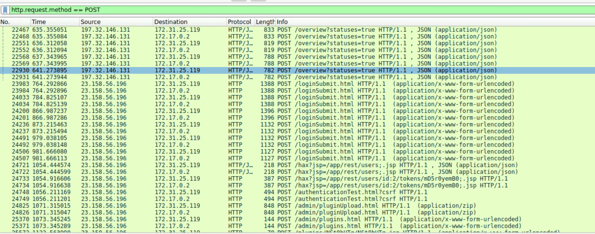

# JetBrains

#### Scenario

During a recent security incident, an attacker successfully exploited a vulnerability in our web server, allowing them to upload webshells and gain full control over the system. The attacker utilized the compromised web server as a launch point for further malicious activities, including data manipulation.

As part of the investigation, You are provided with a packet capture (PCAP) of the network traffic during the attack to piece together the attack timeline and identify the methods used by the attacker. The goal is to determine the initial entry point, the attacker's tools and techniques, and the compromise's extent.

> *Task 1: Identifying the attacker's IP address helps trace the source and stop further attacks. What is the attacker's IP address?*
> 
- Đề bài có 3 gợi ý là:
    - exploited a vulnerability in our web server
    - upload webshells
    - attacker utilized the compromised web server as a launch point for further malicious activities
- gợi ý 1 và 3 chưa thể sử dụng ngay nên mình sẽ sử dụng gợi ý thứ 3, với upload webshell thì mình sẽ lọc ra http method POST
    
    ```jsx
    http.request.method == POST
    ```
    



- gói tin 24825 và 24826 có vẻ giống đường link để upload plugin

`23.158.56.196`

> *Task 2: To identify potential vulnerability exploitation, what version of our web server service is running?*
> 
- sử dụng attacker ip đã tìm được ở trên để lọc ra những gói tin http liên quan tới nó
    
    ```jsx
    http and ip.addr == 23.158.56.196
    ```
    
    
    
- mình tìm được gói tin 24701 có vẻ cho mình thông tin về web server, đây là một lỗ hổng Path Traversal Bypass (chi tiết trong task 3).
- follow http stream để lấy response của server.


- ghi nhận được trường server version là phiên bản của web server.

> *Task 3: After identifying the version of our web server service, what CVE number corresponds to the vulnerability the attacker exploited?*
> 

`CVE-2024-27198`

> *Task 4: The attacker exploited the vulnerability to create a user account. What credentials did he set up?*
> 
- kéo xuống dưới và ghi nhận được một api có vẻ liên quan đến quản lý users.
    
    
    
- follow http stream
    
    
    
- nó nằm trong cùng stream với câu trước, khi vào được /app/rest/server thì server trả về những đường link api nội bộ và trong đó có /app/rest/users để quản lý người dùng.
- attacker đã truy cập được vào api này và tạo một tài khoản với quyền admin mới

`c91oyemw:CL5vzdwLuK`

> *Task 5: The attacker uploaded a webshell to ensure his access to the system. What is the name of the file that the attacker uploaded?*
> 
- trong cùng stream task 3 và 4 thì mình tìm thấy attacker đã gửi upload file bằng đường dẫn `/admin/pluginUpload.html`


- nhìn vào body của gói tin request thì mình tìm được tên file mà attacker đã upload

`NSt8bHTg.zip`

> *Task 6: When did the attacker execute their first command via the web shell?*
> 
- sau khi upload thì attacker đã truy cập vào plugin đó ở gói tin 25572


- mình chỉ cần xem thời gian của gói tin đó


`2024-06-30 08:03`

> *Task 7: The attacker tampered with a text file that contained the credentials of the admin user of the webserver. What new username and password did the attacker write in the file?*
> 
- mình tìm thấy khá nhiều lệnh cmd khi attacker chạy web shell kia, nhưng để tìm được attacker đã sử dụng lệnh nào để tạo và ghi file thì mình sẽ lọc các gói chứa “cmd=”
    
    ```jsx
    http contains "cmd=" and ip.addr == 23.158.56.196
    ```
    


- sau một hồi tìm kiếm thì mình tìm thấy gói tin này với lệnh
    
    ```jsx
    cmd=bash+-c+'echo+"username:a1l4m,password:youarecompromised"+>+/tmp/Creds.txt'
    ```
    
- attacker đã ghi username và password của mình vào file /tmp/Creds.txt để giả mạo đây là tài khoản có sẵn trên hệ thống.

`a1l4m:youarecompromised`

> *Task 8: What is the MITRE Technique ID for the attacker's action in the previous question (Q7) when tampering with the text file?*
> 

`T1565.001`

- Impact - Data Manipulation: Stored Data Manipulation

> *Task 9: The attacker tried to escape from the container but he didn’t succeed, What is the command that he used for that?*
> 
- mình tìm thấy các lệnh


```jsx
docker run --rm -it --privileged ubuntu
docker run --rm -it -v /:/host ubuntu chroot /host
docker run -v /var/run/docker.sock:/var/run/docker.sock -it ubuntu
```

- attacker đã tạo ra một container chạy image là ubuntu với tham số —privileged là sử dụng quyền tối cao cho container này, khi có tham số này thì container không bị cô lập bởi máy host mà có thể toàn quyền truy cập vào phần cứng của máy host.
- attacker đã gắn thư mục / vào /host trong máy container, tham số chroot /host thay đổi thành thư mục gốc của container đó.