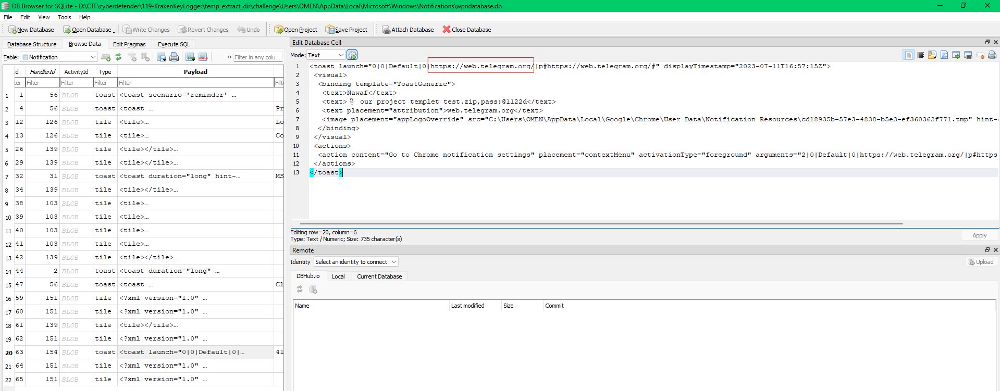

# KrakenKeylogger

#### Scanario

An employee at a large company was assigned a task with a two-day deadline. Realizing that he could not complete the task in that timeframe, he sought help from someone else. After one day, he received a notification from that person who informed him that he had managed to finish the assignment and sent it to the employee as a test. However, the person also sent a message to the employee stating that if he wanted the completed assignment, he would have to pay $160.

The helper's demand for payment revealed that he was a threat actor. The company's digital forensics team was called in to investigate and identify the attacker, determine the extent of the attack, and assess potential data breaches. The team must analyze the employee's computer and communication logs to prevent similar attacks in the future.

> *Q1: What is the the web messaging app the employee used to talk to the attacker?*
> 
- mình tìm thử history của Chrome và Edge nhưng không có. Vì đề bài nói là web nên có thể ứng dụng này chưa được tải về, nên mình tìm thử trong \Users\OMEN\AppData\Local\Microsoft\Windows\Notifications\wpndatabase.db chứa thông báo của windows.

`Telegram`

> *Q2: What is the password for the protected ZIP file sent by the attacker to the employee?*
> 

- một người dùng tên là Nawaf gửi tin nhắn telegram với nội dung là “ 📎 our project templet test.zip,pass:@1122d”, tức là một file đính kèm cùng với password để giải nén file đó.

`@1122d`

> *Q3: What domain did the attacker use to download the second stage of the malware?*
> 
- mình thử kiểm tra file test.zip khi nạn nhân tải về và thấy có file templet.lnk
- khi sử dụng LECmd để kiểm tra file shortcut này

- file shortcut này được link tới powershell.exe kèm agrument, nội dung của agrument này có vẻ như bị obfuscate và bị tràn ra cả trường Icon Location, có thể nội dung của agrument này còn dài hơn nên mình đổi sang sử dụng strings -el với file templet.lnk này luôn

- mình thấy có sử dụng wget nên biến sau đó $NpzibtULgyi có thể chứa domain mình cần tìm.
- vì không thể deofuscate nên mình thử dùng powershell ISE để chạy lệnh wget và các hàm phụ thuộc của nó, sau đó dùng Write-Host để in biến $NpzibtULgyi ra.

`masherofmasters.cyou`

> *Q4: What is the name of the command that the attacker injected using one of the installed LOLAPPS on the machine to achieve persistence?*
> 
- LOLAPPS: Living Of the Land Application:  là sử dụng những app hợp pháp trên windows để thực hiện hành vi trái phép, khác với LOLBins là sử dụng những file thực thi hợp pháp.
- mình kiểm tra những app có sẵn trên máy trong Users/OMEN/AppData/Roaming.

- Greenshot là một ứng dụng để chụp ảnh màn hình

- trong phần ExternalCommand của file cấu hình Greenshot.ini cho phép ứng dụng này sau khi chụp xong sẽ tự chạy MS Paint để chỉnh sửa ảnh đó.
- attacker đã chèn thêm lệnh vào sau trường Commands

`jlhgfjhdflghjhuhuh`

> *Q5: What is the complete path of the malicious file that the attacker used to achieve persistence?*
> 

`C:\Users\OMEN\AppData\Local\Temp\templet.lnk`

> *Q6: What is the name of the application the attacker utilized for data exfiltration?*
> 
- trong các app mà nạn nhân đã tải mình thấy ngay Anydesk, một phần mềm hợp pháp rất hay bị lạm dụng để truy cập trái phép vào máy nạn nhân, trong đó có thể exfitrate data một cách dễ dàng.

`anydesk`

> *Q7: What is the IP address of the attacker?*
> 
- mình kiểm tra ad.trace của anydesk với từ khóa Logged in

