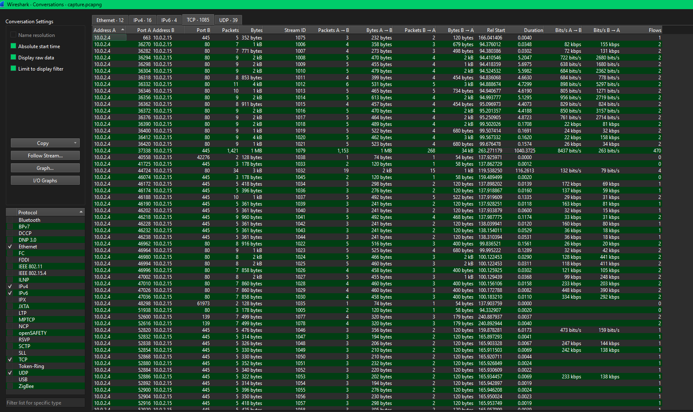

# Lockdown

#### Scenario

TechNova Systems’ SOC has detected suspicious outbound traffic from a public-facing IIS server in its cloud platform—activity suggestive of a web-shell drop and covert connections to an unknown host.

As the forensic examiner, you have three critical artefacts in hand: a PCAP capturing the initial traffic, a full memory image of the server, and a malware sample recovered from disk. Reconstruct the intrusion and all of the attacker’s activities so TechNova can contain the breach and strengthen its defenses.

> *Q1: After flooding the IIS host with rapid-fire probes, the attacker reveals their origin. Which IP address generated this reconnaissance traffic?*
> 

- 10.0.2.4 gửi rất nhiều lưu lượng vào 10.0.2.15 bằng các port khác nhau

`10.0.2.4`

> *Q2: The attacker is carrying out targeted enumeration against the HTTP service on the IIS host. Based on the HTTP request headers, which tool is being used?*
> 
- filter http rồi xem user-agent

`nmap`

> *Q3: While reviewing the SMB traffic, you observe two consecutive Tree Connect requests that expose the first shares the intruder probes on the IIS host. Which two full UNC paths are accessed?*
> 
- filter smb2.cmd == 3, lọc ra các tree connect

`\\10.0.2.15\Documents, \\10.0.2.15\IPC$`

> *Q4: Inside the share, the attacker plants a web-accessible payload that will grant remote code execution. What is the filename of the malicious file they uploaded?*
> 
- cmd = 5 lọc ra các gói tạo thư mục hoặc file

`shell.aspx`

> *Q5: The newly planted shell calls back to the attacker over an uncommon but firewall-friendly port. Which listening port did the attacker use for the reverse shell?*
> 

- mình thấy port 4443 có lượng packet nhiều bất thường

> *Q6: Your memory snapshot captures the system’s kernel in situ, providing vital context for the breach. What is the kernel base address in the dump?*
> 

`0xf80079213000`

> *Q7: A trusted service launches an unfamiliar executable residing outside the usual IIS stack, signalling a persistence implant. What is the final full on-disk path of that executable?*
> 

- dùng plugin windows.pstree thì mình thấy svchost.exe sinh ra w3wp.exe rồi lại sinh ra updatenow.exe
- dịch vụ w3wp của iis thường không sinh ra tiếng trình nào, mà đường dẫn của updatenow.exe nằm ở thư mục start menu của người dùng

`C:\ProgramData\Microsoft\Windows\Start Menu\Programs\Startup\updatenow.exe`

> *Q8: The reverse shell’s outbound traffic is handled by a built-in Windows process that also spawns the implanted executable. What is the name of this process, and what PID does it run under?*
> 

`w3wp.exe, 4332`

> *Q9: Static inspection reveals the binary has been packed to hinder analysis. Which packer was used to obfuscate it?*
> 

[https://www.virustotal.com/gui/file/c25a6673a24d169de1bb399d226c12cdc666e0fa534149fc9fa7896ee61d406f/detection](https://www.virustotal.com/gui/file/c25a6673a24d169de1bb399d226c12cdc666e0fa534149fc9fa7896ee61d406f/detection)

`upx`

> *Q10: Threat-intel analysis shows the malware beaconing to its command-and-control host. Which fully qualified domain name (FQDN) does it contact?*
> 

`cp8nl.hyperhost.ua`

> *Q11: Open-source intel associates that hash with a well-known commodity RAT. To which malware family does the sample belong?*
> 

`AgentTesla`