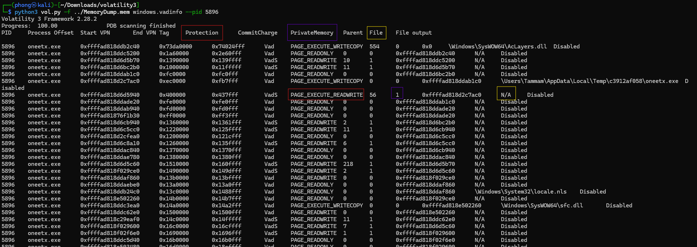

# RedLine

> *Q3: What is the memory protection applied to the suspicious process memory region?*
> 

- phân vùng vad kia là đáng nghi vì chúng ko được backing bởi file trên disk, nhưng có quyền RWX.
- 

BlackEnergy v2