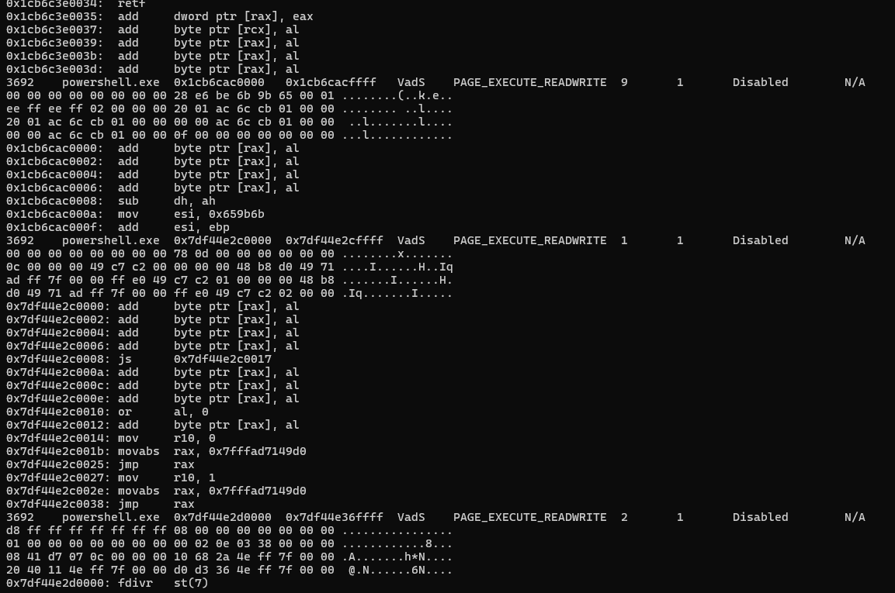

# Reveal

#### Scenario

You are a forensic investigator at a financial institution, and your SIEM flagged unusual activity on a workstation with access to sensitive financial data. Suspecting a breach, you received a memory dump from the compromised machine. Your task is to analyze the memory for signs of compromise, trace the anomaly's origin, and assess its scope to contain the incident effectively.

> *Q1: Identifying the name of the malicious process helps in understanding the nature of the attack. What is the name of the malicious process?*
> 

```jsx
python3 vol.py -f ../192-Reveal.dmp windows.malfind
```



- mình thấy powershell có vẻ khả nghi nên kiểm tra cmd được nạp vào nó
    
    ```jsx
    python3 vol.py -f ../192-Reveal.dmp windows.cmdline --pid 3692
    ```
    
    
    
- powershell được tạo để chạy lệnh net use để truy cập vào share file của attacker
- sau đó lợi dụng rundll32 để chạy hàm entry trong 3435.dll

`powershell.exe`

> *Q2: Knowing the parent process ID (PPID) of the malicious process aids in tracing the process hierarchy and understanding the attack flow. What is the parent PID of the malicious process?*
> 


`4120`

> *Q3: Determining the file name used by the malware for executing the second-stage payload is crucial for identifying subsequent malicious activities. What is the file name that the malware uses to execute the second-stage payload?*
> 

`3435.dll` 

> *Q4: Identifying the shared directory on the remote server helps trace the resources targeted by the attacker. What is the name of the shared directory being accessed on the remote server?*
> 

`davwwwroot`

> *Q5: What is the MITRE ATT&CK sub-technique ID that describes the execution of a second-stage payload using a Windows utility to run the malicious file?*
> 
- Stealth - System Binary Proxy Execution: Rundll32 - `T1218.011`

> *Q6: Identifying the username under which the malicious process runs helps in assessing the compromised account and its potential impact. What is the username that the malicious process runs under?*
> 

```jsx
python3 vol.py -f ../192-Reveal.dmp windows.getsids --pid 3692
```


`Elon` 

> *Q7: Knowing the name of the malware family is essential for correlating the attack with known threats and developing appropriate defenses. What is the name of the malware family?*
> 


`STRELASTEALER`