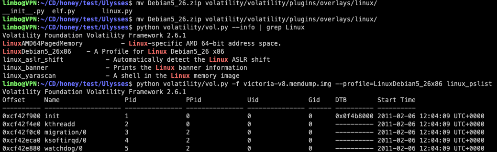

# Ulysses

Scanario

A research server was flagged for suspicious activity after multiple failed authentication attempts. Analysts detected a brute-force attack, unauthorized outbound connections, and possible persistence mechanisms. Using Volatility,

a custom **`Debian5_26`** profile was loaded to analyze memory dumps and identify malicious processes. Your task is to investigate forensic artifacts, determine the attacker's entry point, and uncover any deployed payloads.

- The image verifies the Volatility profile integration and displays the initial process list from the compromised system.



> *Q1: The attacker was performing a Brute Force attack. What account triggered the alert?*
> 
- vào /var/log/auth.log thì mình phát hiện brute force attack với nhiều lượt đăng nhập thất bại


- tuy nhiên chưa ghi nhận được lượt đăng nhập thành công nào vì user `ulysses` không tồn tại trên hệ thống.

> *Q2: During investigating the logs. How many failed login attempts were alerted by the same user?*
> 


`32` 

> *Q3: What kind of system runs on the targeted server?*
> 
- kiểm tra /etc/issue chứa dòng thông báo in ra màn hình khi client đăng nhập bằng ssh
    
    
    

> *Q4: What is the victim's IP address?*
> 
- tức đề đang muốn mình tìm ip của chính chiếc máy này, mình có thể tìm trong file memory


 `192.168.56.102`

> *Q5: What are the attacker's two IP addresses?*
> 


`192.168.56.1, 192.168.56.101`

> *Q6: What is the **`nc`** service PID number that was running on the server?*
> 


`2169`

> *Q7: What service was exploited to gain access to the system?*
> 
- mình kiểm tra trong /var/log thì thấy máy chủ này có sử dụng exim4 làm mail server, kiểm tra log của dịch vụ này thì mình thấy nhiều câu lệnh cmd


- đây là một lỗ hổng tràn bộ đệm của exim4 dẫn tới RCE trên các phiên bản exim4 4.49 trở xuống.
- attacker rce vào server và tải các script và tạo các user nhằm tạo persistance.

`exim4` 

> *Q8: What is the CVE number of exploited vulnerability?*
> 

`CVE-2010-4344`

> *Q9: During this attack, the attacker downloaded two files to the server. Provide the name of the compressed file.*
> 

`rk.tar`

> *Q10: During the investigation, two ports were involved in the process of data exfiltration. Which port did the **`nc`** command used for the exfiltration?*
> 


`8888`

> *Q11: Which port did the attacker try to block on the firewall?*
> 
- kiểm tra trong /tmp/tr.tar


- kiểm tra [install.sh](http://install.sh) thì mình thấy lệnh

```jsx
iptables -I OUTPUT 1 -p tcp --dport 45295 -j DROP
```