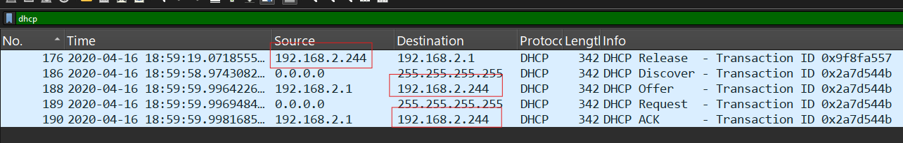
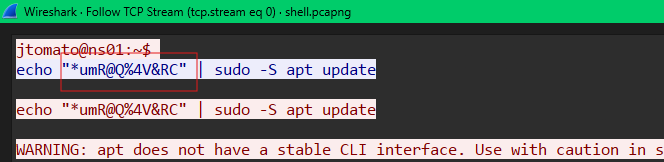
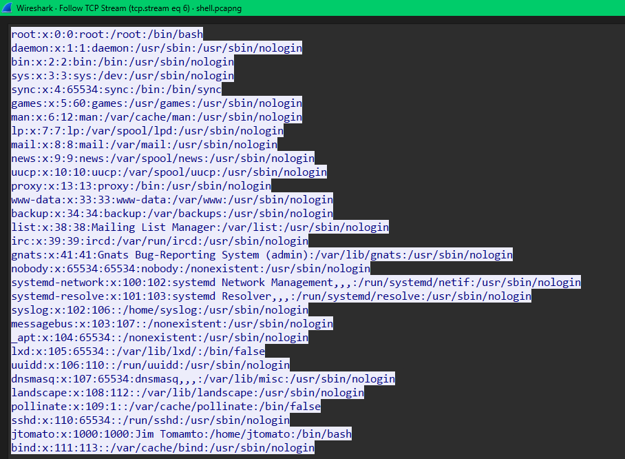
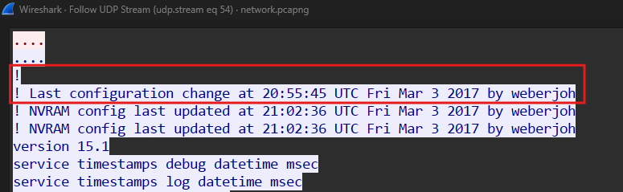

# WireDive

#### Scenario

WireDive is a combo traffic analysis exercise that contains various traces to help you understand how different protocols look on the wire where you can evaluate your DFIR skills against an artifact you usually encounter in today's case investigations as a security blue team member.

#### Challenge Files:

- dhcp.pcapng
- dns.pcapng
- https.pcapng
- network.pcapng
- secret_sauce.txt
- shell.pcapng
- smb.pcapng

#### File: dhcp.pcapng

- các gói tin dhcp cơ bản: D-O-R-A
    - DHCP Discover: client gửi quảng bá để tìm các dhcp server 0.0.0.0 → 255.255.255.255
    - DHCP Offer: server phản hồi lại cho client để đề xuất một cấu hình ip cụ thể.
    - DHCP Request: client quảng bá để chấp nhận đề xuất từ dhcp server đã chọn và thông báo cho các dhcp server khác.
    - DHCP ACK/NAK: server gửi cho client để chấp nhận hoặc từ chối cấp phát IP.

> *Q1: What IP address is requested by the client?*
> 
- trong bài này thì mình filter ra DHCP



- có gói tin DHCP release gửi từ client là thông báo cho dhcp server để giải phóng IP này. Dưới đó là các gói từ server lại đề xuất cho client để cấp phát IP và chấp nhận ACK.

`192.168.2.244`

> *Q2: What is the transaction ID for the DHCP release?*
> 

`0x9f8fa557`

> *Q3: What is the MAC address of the client?*
> 
- địa chỉ MAC của client và server nằm trong tầng data link


#### File: dns.pcapng

> *Q4: What is the response for the lookup for **flag.fruitinc.xyz**?*
> 


- mình thấy có query bản ghi TXT và có response cho bản ghi TXT này, bản ghi TXT chứa dữ liệu text.


`ACOOLDNSFLAG`

> *Q5: Which root server responds to the **google.com** query? Hostname.*
> 


- gói tin 1 là query các root nameserver, sau đó được phản hồi lại danh sách các root nameserver
- sau đó client gửi query A [google.com](http://google.com) tới root nameserver là 192.203.230.10, sau đó mình lên [checkip.com.vn](http://checkip.com.vn) để kiểm tra hostname của 192.203.230.10


#### File: smb.pcapng

- Các gói tin cơ bản của SMB:
    - NEGOTIATE (Request/Response): client và server đàm phán phiên bản,… `0`
    - SESSION_SETUP (Request/Response):                                                        `1`
    - TREE_CONNECT (Request/Response): kết nối vào ổ đĩa/thư mục chia sẻ. `3`
    - TREE_DISCONNECT (Request/Response): ngắt kết nối khỏi thư mục chia sẻ `4`
    - CREATE (Request/Response): tạo mới hoặc mở một file/folder có sẵn.     `5`
    - READ (Request/Response): đọc file.                                                            `8`
    - WRITE (Request/Response): ghi dữ liệu vào file.                                         `9`
    - CLOSE (Request/Response): đóng file.                                                         `6`

> *Q6: What is the path of the file that is opened?*
> 
- mình filter mã lệnh để đọc file của smb là cmd = 8


`HelloWorld\TradeSecrets.txt`

> *Q7: What was the hex status code when the user **SAMBA\jtomato** logs in?*
> 
- filter các gói tin session setup để tìm **SAMBA\jtomato**


- sau khi session setup request thì server sẽ response một mã status, mình kiểm tra gói tin ngay sau đó là gói tin logon failure


`0xc000006d`

> *Q8: What is the tree that is being browsed?*
> 
- filter gói tin TREE_CONNECT bằng cmd = 3


- IPC$ là thư mục ảo ẩn dành cho các dịch vụ quản trị.

`\\192.168.2.10\public`

> *Q9: What is the flag in the file?*
> 
- download file TradeSecrets.txt và tìm được flag

`OneSuperDuperSecret`

#### **File: shell.pcapng**

> *Q10: What port is the shell listening on?*
> 


- mình thấy ngay những gói tcp hand shark từ client kết nối tới server mở tại port 4444

`4444`

> *Q11: What is the port for the second shell?*
> 
- follow luôn stream của hội thoại này


- mình thấy attacker có tải thêm netcat vào máy victim
- sau đó họ tạo một cổng mạng tại 9999 và truyền dữ liệu của /etc/password, khi attacker kết nối tới port này thì dữ liệu của /etc/password sẽ tự được truyền lên máy attacker.

`9999`

> *Q12: What version of netcat is installed?*
> 


`1.10-41.1`

> *Q13: What file is added to the second shell*
> 

`/etc/passwd`

> *Q14: What password is used to elevate the shell?*
> 
- trong shell port 4444 mình đã thấy được attacker truyền password này để dùng sudo



`*umR@Q%4V&RC`

> *Q15: What is the codename of the target system's OS version?*
> 


`bionic`

> *Q16: How many users are on the target system?*
> 
- follow theo stream của shell thứ 2 mình thấy được nó đã hiển thị nội dung của /etc/password



- mỗi user là một dòng, tổng `31` dòng.

**File: network.pcapng**

> *Q17: What is the IPv6 NTP server IP?*
> 
- NTP- Network Time Protocol: là giao thức đồng bộ thời gian trên các máy, các máy sẽ gửi yêu cầu đến NTP server để đồng bộ thời gian.


`2003:51:6012:110::dcf7:123`

> *Q18: What is the first IP address that is requested by the DHCP client?*
> 


- client đã request một ip và bị từ chối, mở gói tin 1245 ra xem sẽ thấy được ip mà client đã yêu cầu.


> *Q19: What is the first authoritative name server returned for the domain that is being queried?*
> 


- mình thấy client query [blog.webernetz.net](http://blog.webernetz.net) tới dns server cục bộ và được response một bản ghi A cùng với các Authoritative name server khác, authorative name server là một dns server quản lý trực tiếp tên miền mà client vừa query.

`ns1.hans.hosteurope.de`

> *Q20: What is the number of the first VLAN to have a topology change occur?*
> 
- STP- Spanning Tree Protocol: giao thức để ngăn chặn vòng lặp trong mạng dùng switch. Khi một cổng trên switch thay đổi trạng thái, nó sẽ báo cho switch root cập nhật lại sơ đồ định tuyến (Topology) trên toàn hệ thống mạng.
- filter stp.flags.tc == 1 để lọc ra Topology Change: yes


> *Q21: What is the port for CDP for **CCNP-LAB-S2**?*
> 
- CDP-Cisco Discovery Protocol: là giao thức độc quyền của Cisco để chia sẻ thông tin giữa các máy (như switch, Router, IP Phone, Firewall) và tự động khám phá ra các thiết bị Cisco khác đang cắm chung cây cáp.


`GigabitEthernet0/2`

> *Q22: What is the MAC address for the root bridge for **VLAN 60**?*
> 
- filter vlan.id == 60 để lọc ra các vlan 60


- toàn bộ đều là giao thức STP, kiểm tra nội dung gói tin


- Root Identifier là định danh của switch root

`00:21:1b:ae:31:80`

> *Q23: What is the IOS version running on **CCNP-LAB-S2**?*
> 
- IOS-Internetwork Operating System: là một hệ điều hành để chạy các thiết bị mạng
- filter ra giao thức CDP


`12.1(22)EA14`

> *Q24: What is the virtual IP address used for HSRP group 121?*
> 
- HSRP-Hot Standby Router Protocol: là giao thức dự phòng gateway, nó kết hợp nhiều router thành một vitural ip, các máy tính trong mạng chỉ cần cấu hình default gateway là vitural ip và các con router sẽ tự tính toán nên đi qua router nào.

filter hsrp2.group == 121 


`192.168.121.1`

> *Q25: How many router solicitations were sent?*
> 
- router soliciations là gói tin yêu cầu định tuyến trên ipv6, thay thế cho dhcp trên ipv4.
- khi một thiết bị mới vào mạng thì nó sẽ chủ động gửi request để xin cấp ip
- gói tin này chạy trên icmpv6, nên mình filter icmpv6.type == 133,


`3`

> *Q26: What is the management address of **CCNP-LAB-S2**?*
> 

```jsx
cdp contains "CCNP-LAB-S2"
```


`192.168.121.20`

> *Q27: What is the interface being reported on in the first SNMP query?*
> 
- SNMP-Simple Network Management Protocol: là giao thức quản lý mạng đơn giản, chủ yếu đến admin cấu hình mạng trên các thiết bị mạng từ xa.


- gói get-request là snmp managerment yêu cầu snmp agent gửi thông tin cấu hình


`FA0/1`

> *Q28: When was the NVRAM config last updated?*
> 
- NVRAM-Non-Volatile Random Access Memory: là bộ nhớ không khả biến thường lưu những cấu hình startup.
- ban đầu mình nghĩ đến giao thức snmp để quản lý các thiết bị mạng, nhưng mình tìm không ra.
- sau đó mình nghĩ đến giao thức tftp cũng thường dùng để lấy và nạp cấu hình vào NVRAM trên các thiết bị mạng.


- mình thấy admin gửi cấu hình đến thiết bị mạng, sau đó thiết bị mạng gửi lại các thông tin xác nhận. Mình sẽ follow stream của thiết bị mạng gửi lại.



`2017-03-03 21:02`

> *Q29: What is the IPv6 of the RADIUS server?*
> 
- RADIUS-Remote Authentication Dial-In User: giao thức sử dụng máy chủ trung tâm để quản lý Authentication, Authorization, and Accounting (AAA) các thiết bị trong mạng.
- giao thức này chạy trên udp


- follow udp stream thì mình thấy đoạn cấu hình radius server


`2001:DB8::1812`

#### **File: https.pcapng**

bài này sử dụng https và trong file có secret_souce.txt, mình cần đưa file này vào TLS trên ws

> *Q30: What has been added to web interaction with **web01.fruitinc.xyz**?*
> 


- follow http stream


`y2*Lg4cHe@Ps`

> *Q31: What is the name of the photo that is viewed in slack?*
> 


`get_a_new_phone_today__720.jpg`

> *Q32: What is the username and password to login to 192.168.2.1?*
> 


- tìm kiếm với từ khóa “password” thì mình nhận được cái gói tin form-urlencoded, là những form do người dùng gửi lên với định dạng url encode.
- follow http2 stream


`admin:Ac5R4D9iyqD5bSh`

> *Q33: What is the certStatus for the certificate with a serial number of **07752cebe5222fcf5c7d2038984c5198**?*
> 


- mình thấy có giao thức OCSP-Online Certificate Status Protocol: dùng để kiểm tra tính hợp lệ của chứng chỉ số theo thời gian thực.
- các gói request để kiểm tra tính hợp lệ của chứng chỉ, các gói response sẽ chứa tính hợp lệ đó là certStatus


`good`

> *Q34: What is the email of someone who needs to change their password?*
> 


- có form khả năng là thay đổi email


`jim.tomato@fruitinc.xyz`

> *Q35: A service is assigned to an interface. What is the interface, and what is the service?*
> 


- mình thấy ở đây có thể là các form, mỗi input cách nhau bởi chuỗi số kia
- mình thấy có input có name là interface và nội dung là lan, tức là interface ở đây là lan
- service là NTP-Network Time Protocol

`lan:ntp`