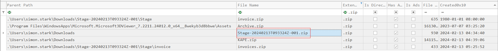

# BFT

**Sherlock Overview:**

In this Sherlock, you will become acquainted with MFT (Master File Table) forensics. You will be introduced to well-known tools and methodologies for analyzing MFT artifacts to identify malicious activity. During our analysis, you will utilize the MFTECmd tool to parse the provided MFT file, TimeLine Explorer to open and analyze the results from the parsed MFT, and a Hex editor to recover file contents from the MFT.

> *Task 1: Simon Stark was targeted by attackers on February 13. He downloaded a ZIP file from a link received in an email. What was the name of the ZIP file he downloaded from the link?*
> 

- `Stage-20240213T093324Z-001.zip` nằm trong thư mục Downloads của user, mã số trên file là thời gian 20240213.

> *Task 2: Examine the Zone Identifier contents for the initially downloaded ZIP file. This field reveals the HostUrl from where the file was downloaded, serving as a valuable Indicator of Compromise (IOC) in our investigation/analysis. What is the full Host URL from where this ZIP file was downloaded?*
> 
- mọi file được tải về từ internet đều ghi nhận thêm một file có luồng phụ là :Zone.Identifier

- ZoneId = 0 (My computer): file nằm sẵn trên máy
- ZoneId = 1 (Intranet): từ mạng nội bộ
- ZoneId = 2  (Trusted sites): file tải từ trang web trong whitelist
- ZoneId = 3 (Internet): tải từ internet
- ZoneId = 4 (Untrusted sites): tải từ web trong blacklist

`https://storage.googleapis.com/drive-bulk-export-anonymous/20240213T093324.039Z/4133399871716478688/a40aecd0-1cf3-4f88-b55a-e188d5c1c04f/1/c277a8b4-afa9-4d34-b8ca-e1eb5e5f983c?authuser`

> *Task 3: What is the full path and name of the malicious file that executed malicious code and connected to a C2 server?*
> 
- Stage-20240213T093324Z-001.zip → invoice.zip → invoice.bat

`C:\Users\simon.stark\Downloads\Stage-20240213T093324Z-001\Stage\invoice\invoices\invoice.bat`

> *Task 4: Analyze the $Created0x30 timestamp for the previously identified file. When was this file created on disk?*
> 

`2024-02-13 16:38:39`

> *Task 5: Finding the hex offset of an MFT record is beneficial in many investigative scenarios. Find the hex offset of the stager file from Question 3.*
> 
- offset number = entry number x 1024
- vì mỗi bản ghi ứng với một entry number = 1024 bytes

- 2346 x 1024 = 23.998.464

`16E3000` 

> *Task 6: Each MFT record is 1024 bytes in size. If a file on disk has smaller size than 1024 bytes, they can be stored directly on MFT File itself. These are called MFT Resident files. During Windows File system Investigation, its crucial to look for any malicious/suspicious files that may be resident in MFT. This way we can find contents of malicious files/scripts. Find the contents of The malicious stager identified in Question3 and answer with the C2 IP and port.*
> 
- file nhỏ hơn 1024 byte thì nội dung của nó sẽ lưu trực tiếp trong $MFT
- mở file $MFT bằng hex editor
- đi tới offset 16E3000

`43.204.110.203:6666`