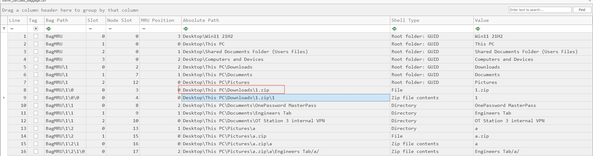

# Baggage

#### **Sherlock Scenario**

This Sherlock provides players with an opportunity to analyze Shellbag artifacts. Shellbags can be used to find evidence of folder access by a specific user, access to network shares, and navigation of archive file contents. This information can be leveraged during investigations to identify potential data access, data staging, and data exfiltration attempts.

- Shellbag là một nhóm các khóa registry trên hệ thống windows ghi lại lịch sử duyệt thư mục, tùy chọn hiển thị của user trong windows explorer.
- Registry hive NTUSER.DAT lưu shellbag của các thư mục hệ thống cục bộ (như Desktop, Downloads, Documents, ổ đĩa C, D,...).
- Registry hive USRCLASS.DAT lưu shellbag của các thư mục mạng, các thiết bị ngoại vi và các file nén.

> *Task 1: What was the name of the archive file downloaded by the compromised account?*
> 
- file tải về của người dùng thường nằm trong thư mục Downloads

`1.zip`

> *Task 2: What was the name of the utility brought in by the attacker to search for sensitive data?*
> 
- khi attacker mở file 1.zip, windows tạo ra một folder Temp1_1.zip bên trong Temp để hiển thị tạm.

- bên trong file 1.zip là 1\Everything-1.4.1.1028.x64.zip
- Everything là phần mềm tìm kiếm thư mục siêu nhanh do voidtools phát triển, attacker tải phần mềm này về và dùng nó để tìm các file cần thiết.

`Everything 1.4.1.1028`

> *Task 3: The attacker navigated the filesystem and found sensitive files used by the victim in their day-to-day work. When was the VPN folder accessed by the attacker?*
> 

- ghi nhận được thư mục OT Station 3 internal VPN liên quan đến VPN
- thời gian truy cập folder này của attacker nằm trong trường Last Write Time, đây là trường windows ghi đè thông tin mới vào file Registry (usrclass.dat). Thường là khi folder được mở, đóng, tắt máy,…
- trường Accessed on thường không cập nhật chính xác những lần user truy cập vào thư mục đó, có thể nó chỉ lưu lại time folder được tạo hoặc truy cập lần đầu.

`2025-09-03 07:31:05`

> *Task 4: What was the name of the directory containing the victim's passwords?*
> 

- ghi nhận được các folder trong thư mục Documents của user được attacker zip lại vào thư mục Pictures\a.zip để chuẩn bị explore ra ngoài
- 1password là một trong những phần mềm quản lý mật khẩu, nó lưu trữ toàn bộ các password của các phần mềm. Muốn vào được 1password chỉ cần một password, user đã lưu password này vào thư mục OnePassword MasterPass cho khỏi quên.

`OnePassword MasterPass` 

> *Task 5: The attacker also accessed a network share to pillage network data. What is the UNC path?*
> 

- Computers and Devices là thư mục Network

`\\Prod-ns-2\prodshare`

> *Task 6: When is the dam construction planned?*
> 

- sau khi vào được thư mục share, attacker đã lấy được tài liệu liên quan đến việc construction 2027
- attacker cũng đưa folder này vào file a.zip và đặt tên là Dam Construction Engineer Plans.zip

`2027` 

> *Task 7: What was the name of the archive file present on the network share?*
> 

`Dam Construction Engineer Plans.zip`

> *Task 8: When was the archive file from the network share accessed?*
> 

`2025-09-03 07:34:04`

> *Task 9: The attacker created a staging folder to prepare for collection and exfiltration. What is the full path of the staging folder?*
> 

- attacker tạo ra folder \a, collection các folder cần thiết rồi zip lại thành a.zip

`C:\users\Steve\Pictures\a`

> *Task 10: The attacker compressed the staging folder to prepare the data for exfiltration. When was the exfiltration archive file accessed?*
> 

`2025-09-03 07:34:30`