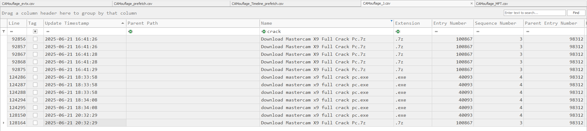

# CAMouflage

#### **Sherlock Scenario**

A newly launched campaign has been detected targeting multiple users utilizing cracked applications. We received an alert indicating unusual behavior from one of our user’s laptops and performed an initial triage. Your task is to conduct a deep dive investigation to determine the root cause and extent of the incident.

> *Task 1: Based on forensic artifacts, at what precise timestamp did the user first execute the Cracked App installer?*
> 
- vì event 4688 chỉ ghi lại vài tiến trình hệ thống nên thử tìm kiếm crack trong file $J



- ghi nhận được user đã tải file Mastercam Full Crack, để biết được thời gian người dùng thực thi file này lần đầu thì tìm trong Prefetch Timeline


`2025-06-21 18:34:19`

> *Task 2: When did the installer process terminate?*
> 
- không có sysmon và 4689 nên ta tìm trong BAM của registry hive SYSTEM, BAM chứa:
    - path của phần mềm user đã kích hoạt
    - timestamp của lần chạy gần nhất, nhưng khi process đó kết thúc nó sẽ ghi timestamp đè vào giá trị này.
- sử dụng Registry và nạp các hive SYSTEM vào


- ta thấy được S-1-5-21-1403634729-3147206146-238420168-500 là của Administrator
- thời gian process này kết thúc là `2025-06-21 18:36:52`

> *Task 3: What was the first file dropped by the malware post-installation?*
> 
- ta biết Mastercam được khởi chạy lúc 2025-06-21 18:34:19, tìm sau khoảng thời gian đó trong $J có file nào được tạo


- thấy có file nsv52EF.tmp được tạo rồi bị xóa ngay → đây có thể chỉ là file tạm, không phải file bị drop xuống.
- timestamp 2025-06-21 18:34:25

`Mysql.wp5`

> *Task 4: What is the SHA-256 hash of the .cab archive extracted during execution?*
> 
- ghi nhận được rất nhiều file .wp5 được tạo ra


- các file này cũng được lưu lại trong artifact bài lab đưa, kiểm tra các file thì có file Play.wp5 có 4 byte đầu là MSCF (Microsoft Cabinet), extention thật của file này là .cab


SHA256: `35efc15a41cf54a51703711e0b117b1899e4698bed1a4fdae638ebb7a3a190e0`

> *Task 5: What command did the malware use to extract content files from that .cab file?*
> 
- ta đã biết Play.wp5 là .cab, cần tìm lệnh đã extract file này
- trong event 4104 không có, thử tìm trong các artifact
- xác định được Mysql.wp5 là một batch script bị obfuscate, trong đó có dòng lệnh
    
    ```jsx
    e%Of%tra%Wide%%Tu%%Warranty% %Unsigned%Y %Municipal%la%Letting%%Assured%%Fastest%p%Ten% *%Assured%*
    ```
    
- trong script có các định nghĩa
    
    ```jsx
    Set Of=x
    Set Wide=c
    Set Tu=3
    Set Warranty=2
    Set Unsigned=/
    Set Municipal=P
    Set Letting=y
    Set Assured=.
    Set Fastest=w
    Set Ten=5
    ```
    
- thay từng biến vào thì ta được lệnh
    
    ```jsx
    extrac32 /Y Play.wp5 *.*
    ```
    
- extract32 là công cụ dòng lệnh tích hợp sẵn trên windows để giải nén các tệp tin .cab

`extrac32 /Y Play.wp5 *.*` 

> *Task 6: During execution, the malware performed AV/EDR checks. How many security product-related strings did it search for in memory or processes?*
>