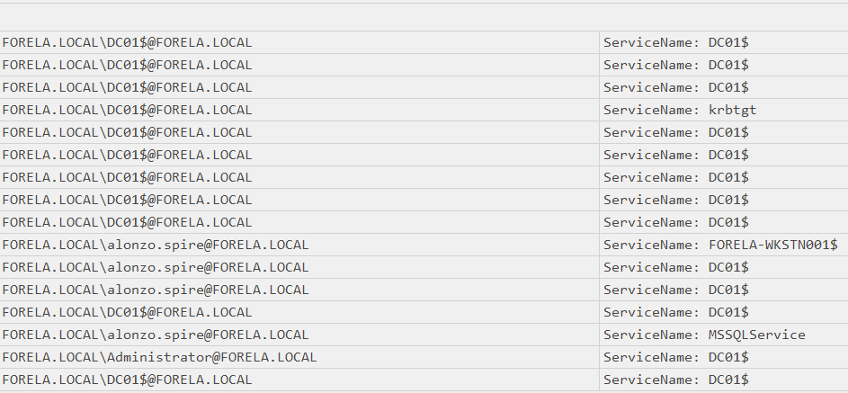

# Campfire-1

#### **Sherlock Scenario**

Alonzo Spotted Weird files on his computer and informed the newly assembled SOC Team. Assessing the situation it is believed a Kerberoasting attack may have occurred in the network. It is your job to confirm the findings by analyzing the provided evidence.

You are provided with:

1- Security Logs from the Domain Controller

2- PowerShell-Operational Logs from the affected workstation

3- Prefetch Files from the affected workstation

> *Task 1: Analyzing Domain Controller Security Logs, can you confirm the UTC date & time when the kerberoasting activity occurred?*
> 
- event 4769 ghi nhận yêu cầu cấp vé kerberos

- ngoài yêu cầu từ tài khoản alonzo.spire@FORELA.LOCAL tới dịch vụ MSSQLService thì còn lại đều là yêu cầu cục bộ (từ tài khoản máy tới tài khoản máy $)

`2024-05-21 03:18:09`

> *Task 2: What is the Service Name that was targeted?*
> 

`MSSQLService`

> *Task 3: It is really important to identify the Workstation from which this activity occurred. What is the IP Address of the workstation?*
> 

`172.17.79.129` 

> *Task 4: Now that we have identified the workstation, a triage including PowerShell logs and Prefetch files are provided to you for some deeper insights so we can understand how this activity occurred on the endpoint. What is the name of the file used to Enumerate Active directory objects and possibly find Kerberoastable accounts in the network?*
> 
- event 4100 ghi nhận không thể thực thi script vào lúc 21/05/2024 03:16:11

- sau đó attacker đã chạy lệnh powershell -ep bypass để bỏ qua policy và cho phép script chạy được.

- có thể thấy script này dài tới 20 khối

`PowerView.ps1` 

> *Task 5: When was this script executed? (UTC)*
> 

`2024-05-21 03:16:32`

> *Task 6: What is the full path of the tool used to perform the actual kerberoasting attack?*
> 

- sau khi chạy file .ps1 để liệt kê các đối tượng AD, cụ thể là tài khoản dịch vụ MSSQLService, attacker sử dụng công cụ Rubeus để gửi các yêu cầu với dịch vụ Kerberos.

`C:\Users\Alonzo.spire\Downloads\Rubeus.exe` 

> *Task 7: When was the tool executed to dump credentials? (UTC)*
> 

`2024-05-21 03:18:08`

| Event ID | Event Name | Description |
| --- | --- | --- |
| 4769 | A Kerberos service ticket was requested | yêu cầu vé ST từ TGS |
| 4100 | Error logging started | ghi lại các lỗi ghi thực thi powershell |
| 4104 | Script Block Logging |  |

Mapping Mitre

| Tactic | ID | Technique | Detail |
| --- | --- | --- | --- |
| Execution | T1059.001 | Command and Scripting Interpreter: Powershell | dùng powershell để chạy script powershell.ps1 |
| Credential Access | T1558.003 | Steal or Forge Kerberos Tickets: Kerberoasting | sử dụng Rubeus để yêu cầu vé Kerberos rồi crack password từ hash của vé. |
| Discovery | T1087.002 | Account Discovery: Domain Account | chạy  .ps1 để liệt kê các đối tượng  |