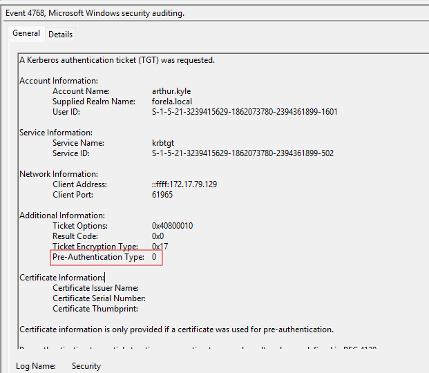

# Campfire-2

#### **Sherlock Scenario**

Forela's Network is constantly under attack. The security system raised an alert about an old admin account requesting a ticket from KDC on a domain controller. Inventory shows that this user account is not used as of now so you are tasked to take a look at this. This may be an AsREP roasting attack as anyone can request any user's ticket which has preauthentication disabled.

- As-Rep Roasting attack cũng là loại tấn công gửi yêu cầu lấy vé và sử dụng hash trong vé đó để crack ra credential. As-Rep attack gửi yêu cầu lấy vé TGT giả mạo tài khoản của người dùng nào đó có thuộc tính **Do not require Kerberos preauthentication**, nghĩa là không cần gửi thông tin xác thực của tài khoản kia và KDC sẽ phản hồi lại bằng vé TGT.
- Còn Kerberoasting attack là attacker gửi yêu cầu lấy vé TGS tới một dịch vụ nào đó, sau đó crack hash đó để có quyền truy cập được vào dịch vụ.

> *Task 1: When did the ASREP Roasting attack occur, and when did the attacker request the Kerberos ticket for the vulnerable user?*
> 
- filter event 4768 và chỉ có duy nhất một event không phải đến từ tài khoản nội bộ (::1)

- log trên cũng cho thấy Pre-Authentication Type: 0

`2024-05-29 06:36:40`

> *Task 2: Please confirm the User Account that was targeted by the attacker.*
> 

`arthur.kyle`

> *Task 3: What was the SID of the account?*
> 

`S-1-5-21-3239415629-1862073780-2394361899-1601`

> *Task 4: It is crucial to identify the compromised user account and the workstation responsible for this attack. Please list the internal IP address of the compromised asset to assist our threat-hunting team.*
> 

`172.17.79.129`

> *Task 5: We do not have any artifacts from the source machine yet. Using the same DC Security logs, can you confirm the user account used to perform the ASREP Roasting attack so we can contain the compromised account/s?*
> 
- yêu cầu của task 5 là tìm ra tài khoản chính xác của máy trạm 172.17.79.129 đã gửi yêu cầu giả mạo người dùng arthur.kyle
- event 4769 có máy 172.17.79.129 yêu cầu vé tgs.

| Event ID | Event Name | Description |
| --- | --- | --- |
| 4768 | A Kerberos authentication ticket (TGT) was requested | yêu cầu vé TGT |
| 4769 | A Kerberos service ticket was requested | yêu cầu vé ST từ TGS |

Mapping Mitre ATT&CK

| Tactic | ID | Technique | Detail |
| --- | --- | --- | --- |
| Initial Access | T1078.002 | Valid Account: Domain Accounts | sử dụng tài khoản happy.grunwald trên máy 172.17.79.129 để giả mạo tải khoản arthur.kyle |
| Credential Access | T1558.004 | Steal or Forge Kerberos Tickets: AS_REP Roasting | giả mạo arthur.kyle để yêu cầu vé TGT |