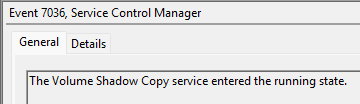

# CrownJewel-1

#### **Sherlock Scenario**

Forela's domain controller is under attack. The Domain Administrator account is believed to be compromised, and it is suspected that the threat actor dumped the NTDS.dit database on the DC. We just received an alert of vssadmin being used on the DC, since this is not part of the routine schedule we have good reason to believe that the attacker abused this LOLBIN utility to get the Domain environment's crown jewel. Perform some analysis on provided artifacts for a quick triage and if possible kick the attacker as early as possible.

- NTDS.dit là tệp databse cốt lõi của AD trên windows server dùng để lưu toàn bộ thông tin về người dùng (password, hash,..), nhóm, và chính sách bảo mật của AD.
- vssadmin là công cụ quản lý Volume Shadow Copy Service (VSS) của windows, công cụ cho phép chụp các bản ghi tức thời của toàn bộ ổ đĩa.
- vssadmin ghi snapshot xong sẽ mount thành phân vùng ổ đĩa ảo độc lập mà không tạo ra file trên hệ thống.

> *Task 1: Attackers can abuse the vssadmin utility to create volume shadow snapshots and then extract sensitive files like NTDS.dit to bypass security mechanisms. Identify the time when the Volume Shadow Copy service entered a running state.*
> 
- kiểm tra event 7036 (Provider: Service Control Manger) trên system log, ghi nhận Volume Shadow Copy service chuyển trạng thái running.

`2024-05-14 03:42:16`

> *Task 2: When a volume shadow snapshot is created, the Volume shadow copy service validates the privileges using the Machine account and enumerates User groups. Find the two user groups the volume shadow copy process queries and the machine account that did it.*
> 
- machine account là tài khoản xác định cho một chiếc máy tính trong AD (chỉ có máy tính trong AD mới có tài khoản này và mỗi máy tính cũng chỉ có một machine account).
- khi chụp ổ đĩa thì vss cần xác thực quyền của 2 group có quyền cao nhất trên máy tính đó và xem machine account của máy đó có quyền nằm trong 2 group này không.
- 2 group mặc định có quyền cao nhất trên một máy windows luôn là Administrators và Backup Operators.
- kiểm tra event 4799 (A security-enabled local group membership was enumerated) ghi nhận danh sách members của một nhóm bảo mật local trên máy tính vừa được liệt kê.

- ghi nhận được 2 group là BUILTIN\Administrators và Backup Operators với machine account là DC01$

`Administrators, Backup Operators, DC01$`

> *Task 3: Identify the Process ID (in Decimal) of the volume shadow copy service process.*
> 
- nhìn ngay trong event 4799 tìm được ở trên với pid là 0x1190

đổi sang hex `4496` 

> *Task 4: Find the assigned Volume ID/GUID value to the Shadow copy snapshot when it was mounted.*
> 
- khi vss chụp được một shadow copy thì nó chỉ là khối dữ liệu thô nằm ẩn trong ổ cứng, để có thể truy cập thì nó sẽ được mount vào thành một đường dẫn cụ thể.
- kiểm tra event 4 trong Microsoft-Windows-Ntfs/Operational ghi nhận một volme NTFS được mount thành công.

`{06c4a997-cca8-11ed-a90f-000c295644f9}`

> *Task 5: Identify the full path of the dumped NTDS database on disk.*
> 
- kiểm tra trên $MFT thì thấy 4 file là ntds.dit

- file đầu được lưu trong \Windows\NTDS là file gốc của hệ thống
- file 2 và 3 được lưu trong \Windows\WinSxS là nơi lưu giữ cách dịch vụ dự phòng hợp pháp của windows.
- file \Windows\System32 cũng là file sao lưu mặc định hoặc file cấu hình mẫu của hệ thống
- file thứ 4 nằm trong thư mục Documents của người dùng chắc chắn là giả mạo vì file ntds.dit không thể để trong này được.
- dấu .\ là đại diện cho thư mục gốc.

`C:\Users\Administrator\Documents\backup_sync_Dc\Ntds.dit`

> *Task 6: When was newly dumped ntds.dit created on disk?*
> 

`2024-05-14 03:44:22`

> *Task 7: A registry hive was also dumped alongside the NTDS database. Which registry hive was dumped and what is its file size in bytes?*
> 
- khi attacker lấy được ntds.dit thì chúng bắt buộc phải lấy thêm ít nhất một tệp cấu hình hệ thống vì dữ liệu trong ntds.dit được mã hóa bằng BOOT KEY.
- registry hive là các tệp cấu hình trên máy, các hive này chỉ ở trong root key HKLM
    - HKEY_LOCAL_MACHINE\ SYSTEM: \system32\config\system
    - HKEY_LOCAL_MACHINE\ SAM: \system32\config\sam
    - HKEY_LOCAL_MACHINE\ SECURITY: \system32\config\security
    - HKEY_LOCAL_MACHINE\ SOFTWARE: \system32\config\software
    - HKEY_LOCAL_MACHINE\COMPONENTS: \System32\config\COMPONENTS
    - HKEY_USERS\.DEFAULT : \System32\config\DEFAULT
    - HKEY_CURRENT_USER: C:\Users\<Tên_User>\**NTUSER.DAT**
- tìm kiếm path chứa ntds.dit copy ở task 6, trong đó có chứa file SYSTEM.

#### Mapping Mitre

| Tactic | ID | Technique | Detail |
| --- | --- | --- | --- |
| Credential Access | T1003.003 | OS Credential Dumping: NTDS | tạo shadow copy để đánh cắp ntds.dit |
|  | T1003.002 | OS Credential Dumping: Secutiry Account Mangager | registry hive SYSTEM |
| Collection | T1074.001 | Data Staged: Local Data Staging | copy ntds.dit và SYSTEM vào một folder để chuẩn bị exfitration |