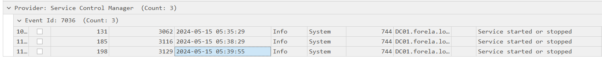

# CrownJewel-2

#### **Sherlock Scenario**

Forela's Domain environment is pure chaos. Just got another alert from the Domain controller of NTDS.dit database being exfiltrated. Just one day prior you responded to an alert on the same domain controller where an attacker dumped NTDS.dit via vssadmin utility. However, you managed to delete the dumped files kick the attacker out of the DC, and restore a clean snapshot. Now they again managed to access DC with a domain admin account with their persistent access in the environment. This time they are abusing ntdsutil to dump the database. Help Forela in these chaotic times!!

- ntdsutil là công cụ dòng lệnh có sẵn trên windows server được thiết kế cho các quản trị viên hệ thống quản lý, bảo trì và khắc phục sự cố trên  AD DS. Nó có thể tạo các snapshot của csdl AD để sao lưu và khôi phục
- ntdsutil vẫn sử dụng vss để snapshot ổ cứng và copy file ổ đĩa ảo mà vss tạo ra, hành động này sẽ tạo ra sự kiện ghi file.

> *Task 1: When utilizing ntdsutil.exe to dump NTDS on disk, it simultaneously employs the Microsoft Shadow Copy Service. What is the most recent timestamp at which this service entered the running state, signifying the possible initiation of the NTDS dumping process?*
> 
- ghi nhận event 7036 có 3 log về Volum Shadow Copy

- timestamp gần nhất running là `2024-05-15 05:39:55`

> *Task 2: Identify the full path of the dumped NTDS file.*
> 
- như phân tích ở trên thì ntdsutil vẫn sử dụng vss để trích xuất snapshot nhưng sẽ tạo ra sự kiện ghi file, bài này không cung cấp sysmon log nên sẽ khó khăn hơn trong việc tìm sự kiện ghi file.
- event 325 (The database engine created a new database) trên application.evtx

- những đường dẫn trên đều là đường dẫn hợp lệ, nhưng ntds.dit sẽ không bao giờ được lưu trong thư mục Temp như vậy cả.

`C:\Windows\Temp\dump_tmp\Active Directory\ntds.dit`

> *Task 3: When was the database dump created on the disk?*
> 
- nhìn ngay trong event 325 tìm được ở trên

`2024-05-15 05:39:56` 

> *Task 4: When was the newly dumped database considered complete and ready for use?*
> 
- event 325 (The database engine created a new database) → database mới được create mà chưa có data.
- event 326 (The database engine attached a database) → truyền data vào new database.
- event 327 (The database engine detached a database) → kết thúc tạo và truyền data vào new database.

> *Task 5: Event logs use event sources to track events coming from different sources. Which event source provides database status data like creation and detachment?*
> 
- `ESENT` (Extensible Storage Engine) - công cụ quản lý csdl nhúng của Microsoft trên windows, ntds.dit là do ESENT quản lý.
- 

> *Task 6: When ntdsutil.exe is used to dump the database, it enumerates certain user groups to validate the privileges of the account being used. Which two groups are enumerated by the ntdsutil.exe process? Give the groups in alphabetical order joined by comma space.*
> 
- event 4799 (A security-enabled local group membership was enumerated)

`Administrators, Backup Operators`

> *Task 7: Now you are tasked to find the Login Time for the malicious Session. Using the Logon ID, find the Time when the user logon session started.*
> 
- khi lấy được ntds.dit thì attacker có thể có được tất cả NTLM hash của tất cả các tài khoản trong hệ thống, từ đó có thể tấn công pass-the-hash.
- khi có NTLM hash của tài khoản kbrtgt, attacker có thể tạo ra Golden Ticket và vé này truy cập được vào mọi dịch vụ và user trên hệ thống xác thực Kerberos (kỹ thuật pass-the-ticket).
- trong bài này không ghi lại log 4624
- event 4769 (A Kerberos service ticket was requested) ghi lại sự kiện yêu cầu ticket của dịch vụ Kerberos, từ đây có thể tìm được attacker có tấn công pass-the-ticket không.

- các event trên đều là request của các tài khoản máy mà con người không thể đăng nhập vào tài khoản này, chỉ event cuối là của admin.

`2024-05-15 05:36:18`

| Event ID | Event Name | Detail |
| --- | --- | --- |
| 7036 | The service entered the running/stopped state | ghi nhận một service chuyển sang trạng thái running/stopped |
| 325 | The database engine created a new database | database mới được tạo mà chưa có dữ liệu |
| 326 | The database engine attached a database | ghi dữ liệu vào database mới |
| 327 | The database engine detached a database | quá trình tạo và ghi dữ liệu kết thúc |
| 4799 | A security-enabled local group membership was enumerated | thành viên của nhóm local được liệt kê. |
| 4769 | A Kerberos service ticket was requested | một yêu cầu ticket của Kerberos |

Mapping Mitre ATT&CK

| Tactic | ID | Technique | Detail |
| --- | --- | --- | --- |
| Credential Access | T1003.003 | OS Credential Dumping: NTDS | dump ntds.dit bằng ntdsutil |
|  | T1558.001 | Steal or Forge Kerberos Tickets: Golden Ticket | trộm vé của tài khoản kbrtgt và tạo ra golden ticket. |