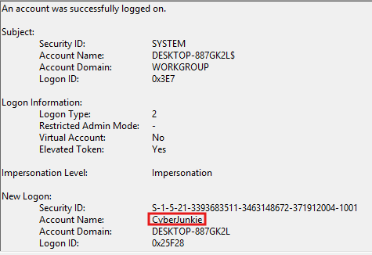

# Logjammer

#### **Sherlock Scenario**

You have been presented with the opportunity to work as a junior DFIR consultant for a big consultancy. However, they have provided a technical assessment for you to complete. The consultancy Forela-Security would like to gauge your knowledge of Windows Event Log Analysis. Please analyse and report back on the questions they have asked.

> *Task 1: When did the cyberjunkie user first successfully log into his computer? (UTC)*
> 
- event 4624



`27/03/2023 14:37:09`

> *Task 2: The user tampered with firewall settings on the system. Analyze the firewall event logs to find out the Name of the firewall rule added?*
> 
- trong Microsoft-Windows-Windows Firewall With Advanced Security/Firewall
    - event id 2004: a rule has been added
    - event id 2005: rule bị chỉnh sửa
    - event id 2006: rule bị xóa
    - event id 2033: tất cả các rules đã bị xóa
- tìm trong event 2004 với user id là S-1-5-21-3393683511-3463148672-371912004-1001 của user cyberjunkie trong task 1.


- mmc.exe (microsoft managerment console) là một công cụ quản trị hệ thống được tích hợp sẵn trong hệ điều hành windows, nó cung cấp giao diện đồ họa cho các công cụ quản trị như Windows Defender Firewall with Advanced Security hoặc Event Viewer.

`Metasploit C2 Bypass`

> *Task 3: Whats the direction of the firewall rule?*
> 
- nhìn ngay trường Direction trong event 2004 ở trên
- Direction: Outbound và Action: Allow nghĩa là cho phép công cụ Metasploit C2 Bypass đi ra ngoài mạng.

`Outbound`

> *Task 4: The user changed audit policy of the computer. Whats the Subcategory of this changed policy?*
> 
- event 4719 ghi nhận audit policy bị thay đổi
- 27/03/2023 14:50:03


- Security ID và Account Name cho thấy đây là hệ thống tự thực hiện, có thể attacker đã chạy công cụ khiến cho SYSTEM tự thực hiện hành động thay đổi audit policy.
- Subcategory: `Other Object Access Events`

> *Task 5: The user "cyberjunkie" created a scheduled task. Whats the name of this task?*
> 
- event 4698 ghi nhận schedule task được tạo với Task Name là `HTB-AUTOMATION`
- timestamp: 27/03/2023 14:51:21


```jsx
<Task version="1.2" xmlns="http://schemas.microsoft.com/windows/2004/02/mit/task">
  <RegistrationInfo>
    <Date>2023-03-27T07:51:21.4599985</Date>
    <Author>DESKTOP-887GK2L\CyberJunkie</Author>
    <Description>practice</Description>
    <URI>\HTB-AUTOMATION</URI>
  </RegistrationInfo>
  <Triggers>
    <CalendarTrigger>
      <StartBoundary>2023-03-27T09:00:00</StartBoundary>
      <Enabled>true</Enabled>
      <ScheduleByDay>
        <DaysInterval>1</DaysInterval>
      </ScheduleByDay>
    </CalendarTrigger>
  </Triggers>
  <Principals>
    <Principal id="Author">
      <RunLevel>LeastPrivilege</RunLevel>
      <UserId>DESKTOP-887GK2L\CyberJunkie</UserId>
      <LogonType>InteractiveToken</LogonType>
    </Principal>
  </Principals>
  <Settings>
    <MultipleInstancesPolicy>IgnoreNew</MultipleInstancesPolicy>
    <DisallowStartIfOnBatteries>true</DisallowStartIfOnBatteries>
    <StopIfGoingOnBatteries>true</StopIfGoingOnBatteries>
    <AllowHardTerminate>true</AllowHardTerminate>
    <StartWhenAvailable>false</StartWhenAvailable>
    <RunOnlyIfNetworkAvailable>false</RunOnlyIfNetworkAvailable>
    <IdleSettings>
      <Duration>PT10M</Duration>
      <WaitTimeout>PT1H</WaitTimeout>
      <StopOnIdleEnd>true</StopOnIdleEnd>
      <RestartOnIdle>false</RestartOnIdle>
    </IdleSettings>
    <AllowStartOnDemand>true</AllowStartOnDemand>
    <Enabled>true</Enabled>
    <Hidden>false</Hidden>
    <RunOnlyIfIdle>false</RunOnlyIfIdle>
    <WakeToRun>false</WakeToRun>
    <ExecutionTimeLimit>P3D</ExecutionTimeLimit>
    <Priority>7</Priority>
  </Settings>
  <Actions Context="Author">
    <Exec>
      <Command>C:\Users\CyberJunkie\Desktop\Automation-HTB.ps1</Command>
      <Arguments>-A cyberjunkie@hackthebox.eu</Arguments>
    </Exec>
  </Actions>
</Task>
```

- Schedule Task này thực hiện chạy C:\Users\CyberJunkie\Desktop\Automation-HTB.ps1 -A cyberjunkie@hackthebox.eu vào 9h sáng mỗi ngày.

> *Task 6: Whats the full path of the file which was scheduled for the task?*
> 
- nhìn vào event 4698 ở trên.

`C:\Users\CyberJunkie\Desktop\Automation-HTB.ps1`

> *Task 7: What are the arguments of the command?*
> 

`-A cyberjunkie@hackthebox.eu`

> *Task 8: The antivirus running on the system identified a threat and performed actions on it. Which tool was identified as malware by antivirus?*
> 
- Microsoft-Windows-Windows Defender/Operational
    - event id 1116: Antivirus malware detection
    - event id 1117: Antivirus remediation action taken
    - event id 1119: Antivirus remediation action failed
- kiểm tra event 1116
- 27/03/2023 14:42:34


- Name: HackTool:MSIL/SharpHound!MSR
    - HackTool: phân loại đây là công cụ hack
    - MSIL: Microsoft Intermediate Language cho biết công cụ được viết bằng .NET và được biên dịch sang dạng ngôn ngữ trung gian của MS
    - SharpHound: tên của công cụ, đây là phần mềm chuyên dùng để thám thính và thu thập hồ sơ mạng AD nhằm tìm ra các đường đi cơ sở để chiếm quyền domain admin.
    - !MSR: quy tắc nhận diện của MS thiết lập.

`SharpHound`

> *Task 9: Whats the full path of the malware which raised the alert?*
> 


- vẫn trong event ở trên thì ta thấy được file này được tải về từ user cyberjunkie trên Internet.
- containerfile là thư mục cha chứa file này là tệp .zip
- file: `C:\Users\CyberJunkie\Downloads\SharpHound-v1.1.0.zip`
- trong file zip được giải nén ra 2 file .ps1 và .exe

> *Task 10: What action was taken by the antivirus?*
> 


- timestamp: 27/03/2023 14:42:48
- Acction: `Quarantine` → AV đã cách ly thành công malware này.

> *Task 11: The user used Powershell to execute commands. What command was executed by the user?*
> 
- event 4104 ghi lại toàn bộ khối lệnh được thực thi trên powershell, kể cả đoạn mã bên trong một script.
- 27/03/2023 14:58:33


- đây là lệnh tính ra md5 của file .ps1

`Get-FileHash -Algorithm md5 .\Desktop\Automation-HTB.ps1` 

> *Task 12: We suspect the user deleted some event logs. Which Event log file was cleared?*
> 
- event 1102 trên security log ghi lại người xóa.


- event 104 của system log ghi lại Log Name.


`Microsoft-Windows-Windows Firewall With Advanced Security/Firewall` 

| Event ID | Event Name | Detail |
| --- | --- | --- |
| 2004 | A rule has been added to the Windows Firewall exception list | một rule được thêm. |
| 2005 | A rule has been modified to the Windows Firewall exception list | một rule bị thay đổi |
| 2006 | A rule has been deleted to the Windows Firewall exception list | một rule bị xóa |
| 2033 | All rules have been deleted from the Windows Firewall configuration on this computer | tất cả các rule bị xóa |
| 4719 | System audit policy was changed |  |
| 4698 | A schedule task was created |  |
| 1116 | Antivirus malware detection | av phát hiện malware |
| 1117 | Antivirus remediation action taken | av chặn được malware |
| 1118 | Antivirus remediation action failed | av không chặn được malware |
| 4104 | PowerShell Script Block | ghi lại lệnh powershell và nội dung của script đã chạy trên powershell |
| 1102 | The audit log was cleared | ghi lại chủ thể xóa log |
| 104 | The … log was cleared | ghi lại Log Name đã bị xóa |

Mapping Mitre ATT&CK

| Tactic | ID | Technique | Detail |
| --- | --- | --- | --- |
| Initial Access | T1078.003 | Valid Account: Local Account | dùng tài khoản cyberjunkie để đăng nhập |
| Execution | T1059.001 | Command and Scripting Interpreter: Powershell | chạy Get-FileHash |
| Persistence | T1053.005 | Schedule Task/Job: Schedule Task | thêm schedule task chạy .ps1 vào 9h sáng mỗi ngày |
| Defense Evasion | T1685.005 | Disable or Modivy Tools: Clear Winodws Event Logs | xóa log |