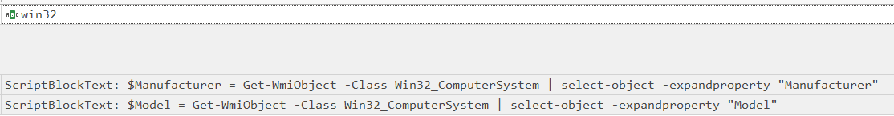

# Operation Blackout 2025: Phantom Check

#### **Sherlock Scenario**

Talion suspects that the threat actor carried out anti-virtualization checks to avoid detection in sandboxed environments. Your task is to analyze the event logs and identify the specific techniques used for virtualization detection. Byte Doctor requires evidence of the registry checks or processes the attacker executed to perform these checks.

> *Task 1: Which WMI class did the attacker use to retrieve model and manufacturer information for virtualization detection?*
> 
- các WMI class phổ biến
    - Win32_Processor: chứa thông tin về chip CPU
    - Win32_LogicalDisk: chứa thông tin về các ổ đĩa trên máy
    - Win32_Process: quản lý các tiến trình đang chạy trên máy
    - Win32_Service: chứa thông tin về dịch vụ hệ thống
    - Win32_ComputerSystem: chứa thông tin tổng quan về máy tính

- attacker dùng `Win32_ComputerSystem` để lấy ra Manufacturer và Model, nếu kết quả có xuất hiện các ký tự như Vmware, ViuturalBox,.. thì mã độc sẽ không chạy nữa.

> *Task 2: Which WMI query did the attacker execute to retrieve the current temperature value of the machine?*
> 

- wmi này để kiểm tra nhiệt độ của máy, nếu là trên các phần mềm ảo hóa thì máy sẽ không giả lập nhiệt độ của phần cứng cho nên nó sẽ trả về null.

`SELECT * FROM MSAcpi_ThermalZoneTemperature`

> *Task 3: The attacker loaded a PowerShell script to detect virtualization. What is the function name of the script?*
> 

> *Task 4: Which registry key did the above script query to retrieve service details for virtualization detection?*
> 

`HKLM:\SYSTEM\ControlSet001\Services`

- registry key này là nơi windows lưu trữ toàn bộ danh sách và cấu hình của dịch vụ hệ thống và các drivers.

> *Task 5: The VM detection script can also identify VirtualBox. Which processes is it comparing to determine if the system is running VirtualBox?*
> 

`vboxservice.exe, vboxtray.exe`

> *Task 6: The VM detection script prints any detection with the prefix 'This is a'. Which two virtualization platforms did the script detect?*
> 

`Hyper-V, Vmware`