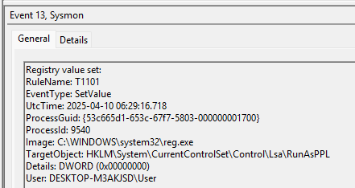

# Operation Blackout 2025: Smoke & Mirrors

#### **Sherlock Scenario**

Byte Doctor Reyes is investigating a stealthy post-breach attack where several expected security logs and Windows Defender alerts appear to be missing. He suspects the attacker employed defense evasion techniques to disable or manipulate security controls, significantly complicating detection efforts.

Using the exported event logs, your objective is to uncover how the attacker compromised the system's defenses to remain undetected.

> *Task 1: The attacker disabled LSA protection on the compromised host by modifying a registry key. What is the full path of that registry key?*
> 
- sysmon 12: RegistryEvent - Object creation and deletion
- sysmon 13: RegistryEvent - Value set: giá trị registry bị thay đổi nội dung
- sysmon 14: RegistryEvent - Key and Value Rename
- key của LSA Protection nằm ở HKLM\System\CurrentControlSet\Control\Lsa



- timestamp: 2025-04-10 06:29:16
- RunAsPPL thiết lập protection cho LSA
    - value 0: tắt protection
    - value 1: bật protection
    - value 2: protection nâng cao
- value được set là 0x0000000, tắt cơ chế bảo vệ lsasss.

`HKLM\SYSTEM\CurrentControlSet\Control\LSA`

> *Task 2: Which PowerShell command did the attacker first execute to disable Windows Defender?*
> 
- lệnh để cấu hình toàn bộ hoạt động của windows defender là Set-MpPreference, MP là microsoft malware protection.
- kiểm tra event 4104 trên powershell


- timestamp:  2025-04-10 06:31:32

`Set-MpPreference -DisableIOAVProtection $true -DisableEmailScanning $true -DisableBlockAtFirstSeen $true`

> *Task 3: The attacker loaded an AMSI patch written in PowerShell. Which function in the DLL is being patched by the script to effectively disable AMSI?*
> 
- AMSI (Antimalware Scan Interface) là tính năng bảo mật của windows giúp các phần mềm AV đọc được đoạn mã script trước khi nó thực thi.
    
    
    
- timestamp: 2025-04-10 06:37:47

`AmsiScanBuffer`

> *Task 4: Which command did the attacker use to restart the machine in Safe Mode?*
> 
- lệnh vào safe mode không mạng
    
    ```jsx
    bcdedit /set {current} safeboot minimal
    ```
    
- lệnh vào safe mode có mạng
    
    ```jsx
    bcdedit /set {current} safeboot network
    ```
    


- timestamp: 2025-04-10 06:38:35
- attacker vào safeboot với network nằm né tránh av, EDR, logging.

`bcdedit.exe /set safeboot network`

> *Task 5: Which PowerShell command did the attacker use to disable PowerShell command history logging?*
> 
- timestamp: 2025-04-10 06:38:43


`Set-PSReadlineOption -HistorySaveStyle SaveNothing`

Event 

| Event ID | Event Name | Detail |
| --- | --- | --- |
| sysmon 12 | RegistryEvent - Object creation and deletion | tạo hoặc xóa key/value |
| sysmon 13 | RegistryEvent - Value set | chỉnh sửa key |
| sysmon 14 | RegistryEvent - Key and Value Rename | đổi tên key/value |
| 4104 | Script Block Logging | ghi lại các khối lệnh và nội dung cript được thực thi trong powershell |

#### Mapping Mitre

| Tactic | ID | Technique | Detail |
| --- | --- | --- | --- |
| Persistence | T1112 | Modify Registry | set RunAsPPL = 0 |
| Defense Impairment | T1685 | Disable or Modify Tool | tắt monitor trên windows defender, disbale AMSI |
|  | T1688 | Safe Mode Boot | vào safeboot để né defense |
|  | T1690 | Prevent Command History Logging | tắt ghi history log |