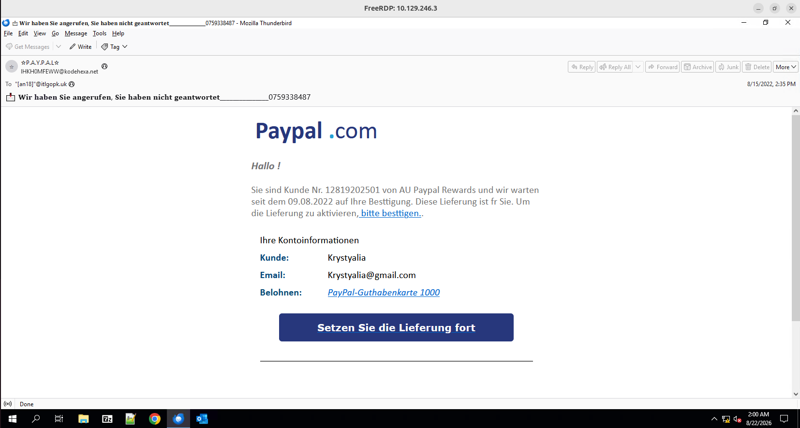

# Phishing_Email

#### **Sherlock Scenario**

Your email address has been leaked and you receive an email from Paypal in German. Try to analyze the suspicious email.

> *Task 1: What is the return path of the email?*
> 

- nhìn qua email thấy địa chỉ người gửi là PAYPAL.com nhưng trong địa chỉ email thực tế lại là IHKH0MFEWW@kodehexa.net

`<bounce@rjttznyzjjzydnillquh.designclub.uk.com>`

> *Task 2: What is the domain name of the url in this mail?*
> 

`storage.googleapis.com`

> *Task 3: Is the domain mentioned in the previous question suspicious?*
> 
- [googleapis.com](http://googleapis.com/) là dịch vụ lưu trữ công cộng của google cloud store, paypal không bao giờ lưu trữ trang đăng nhập hay xác nhận của họ trên một kho lưu trữ file mở của google

`yes` 

> *Task 4: What is the body SHA-256 of the domain?*
> 

`13945ecc33afee74ac7f72e1d5bb73050894356c4bf63d02a1a53e76830567f5`