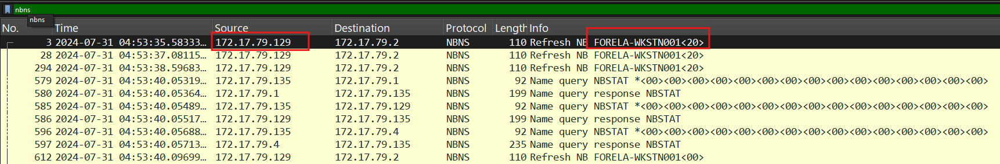

# Reaper

#### **Sherlock Scenario**

Our SIEM alerted us to a suspicious logon event which needs to be looked at immediately . The alert details were that the IP Address and the Source Workstation name were a mismatch .You are provided a network capture and event logs from the surrounding time around the incident timeframe. Corelate the given evidence and report back to your SOC Manager.

> *Task 1: What is the IP Address for Forela-Wkstn001?*
> 
- NBNS (NetBIOS Name Service): giao thức cũ để tìm địa chỉ ip khi không có DNS, gửi các gói broadcast - gửi toàn bộ máy trong mạng.
- LLMNR ((Link-Local Multicast Name Resolution): tương tự như NBNS nhưng mới hơn, gửi các gói multicast - chỉ gửi cho các máy hỗ trợ giao thức này, đỡ bị nghẽn mạng.
- thử tìm các gói dns và llmnr nhưng đều không tìm thấy ip của *Forela-Wkstn001*
- tìm với giao thức nbns

- ngoài các gói query và response như dns và llmnr thì nbns có thêm các gói registration và refresh để đăng ký và làm mới tên miền mà máy đó sử dụng trong hệ thống mạng.
- gói tin 3 là gói máy 172.17.79.129 muốn làm mới tên *Forela-Wkstn001*

`172.17.79.129`

> *Task 2: What is the IP Address for Forela-Wkstn002?*
> 
- tương tự task 1

`172.17.79.136`

> *Task 3: What is the username of the account whose hash was stolen by attacker?*
> 
- kiểm tra event 4624 thì thấy ngoài sự đăng nhập của các dịch vụ thì có sự đăng nhập thành công bằng dịch vụ ntlm.
- 31/07/2024 04:55:16

- source ip là 172.17.79.135 với hostname là FORELA-WKSTN002, nhưng ở trên ta đã biết ip của FORELA-WKSTN002 là 172.17.79.136 → đây chắc chắn là một thiết bị khác cố tình giả danh máy FORELA-WKSTN002. Logon type 3 đăng nhập qua network, có thể là qua dịch vụ smb.
- filter lưu lượng smb để xem ip này có truy cập vào file share nào không

`arthur.kyle`

> *Task 4: What is the IP Address of Unknown Device used by the attacker to intercept credentials?*
> 

`172.17.79.135`

> *Task 5: What was the fileshare navigated by the victim user account?*
> 
- ta biết máy vitim là FORELA-WKSTN002 với ip là 172.17.79.136

`\\DC01\Trip` 

> *Task 6: What is the source port used to logon to target workstation using the compromised account?*
> 
- xem lại log 4624

`40252`

> *Task 7: What is the Logon ID for the malicious session?*
> 

`0x64A799` 

> *Task 8: The detection was based on the mismatch of hostname and the assigned IP Address.What is the workstation name and the source IP Address from which the malicious logon occur?*
> 

`FORELA-WKSTN002, 172.17.79.135` 

> *Task 9: At what UTC time did the the malicious logon happen?*
> 

`2024-07-31 04:55:16` 

> *Task 10: What is the share Name accessed as part of the authentication process by the malicious tool used by the attacker?*
> 
- event 5140 ghi nhận một đối tượng share được truy cập.

`\\*\IPC$`

| Event ID | Event Name  | Detail |
| --- | --- | --- |
| 5140 | A network share object was accessed |  |