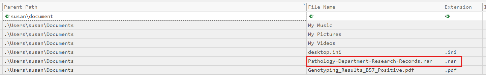

# RomCom

#### **Sherlock Scenario**

Susan works at the Research Lab in Forela International Hospital. A Microsoft Defender alert was received from her computer, and she also mentioned that while extracting a document from the received file, she received tons of errors, but the document opened just fine. According to the latest threat intel feeds, WinRAR is being exploited in the wild to gain initial access into networks, and WinRAR is one of the Software programs the staff uses. You are a threat intelligence analyst with some background in DFIR. You have been provided a lightweight triage image to kick off the investigation while the SOC team sweeps the environment to find other attack indicators.

- $J là nhật ký hệ thống ghi lại mọi thay đổi tên file và thư mục trên windows.

> *Task 1: What is the CVE assigned to the WinRAR vulnerability exploited by the RomCom threat group in 2025?*
> 

`CVE-2025-8088` 

- Đây là lỗ hổng path traversal liên quan đến cơ chế giải nén của winrar, lỗ hổng tồn tại trên các bản winra từ 7.12 trở xuống. Lợi dụng cơ chế giải nén tệp tin có ADS, attacker chèn các đường dẫn ../../ để winra thay vì giải nén ra file nằm trong thư mục hiện tại, nó sẽ bị giải nén ra các vị trí khác như thư mục Startup của windows.

> *Task 2: What is the nature of this vulnerability?*
> 

`path traversal` 

> *Task 3: What is the name of the archive file under Susan's documents folder that exploits the vulnerability upon opening the archive file?*
> 
- kiểm tra tệp $MFT

`Pathology-Department-Research-Records.rar`

> *Task 4: When was the archive file created on the disk?*
> 

`2025-09-02 08:13:50`

> *Task 5: When was the archive file opened?*
> 

- x10 thuộc $STANDARD_INFORMATION, nghĩa là thời gian hiện tại trong metadata, metadata có thể bị thay đổi liên tục.
- x30 thuộc $FILE_NAME, là thời gian kernel ghi xuống mft khi sự kiện file xảy ra và khó bị thay đổi hơn.
- windows có cơ chế là khi user truy cập một file, nó sẽ ghi lại file đó ở phần recent file, để đảm bảo sau này user có di chuyển file này đi chỗ khác thì mục recent file sẽ tìm thấy nó, nên windows sẽ đánh object id cho nó. Khi file mới tạo lần đầu chưa có object id, khi user truy cập file đó lần đầu thì object id mới được ghi.
- nên dựa vào ObjectIdChange trong $J ta có thể đoán ra đó là thời điểm user truy cập file.
- khi Object id được tạo thì nó cũng thay đổi metadata nên cũng sẽ được ghi lại tại Last Record Change0x10
- `2025-09-02 08:14:04`

> *Task 6: What is the name of the decoy document extracted from the archive file, meant to appear legitimate and distract the user?*
> 
- attacker thường lợi dụng lỗ hổng này để tạo ra các file .exe, .dll, .lnk vào các thư mục startup của window.
- attacker cũng tạo một file hợp lệ nằm trong cùng folder với archive file, nhằm làm sao nhãng sự chú ý của người dùng tới file này và coi như archive file này là hoàn toàn bình thường
- path archive file là susan\document và thấy một file .pdf ngay sau thời gian archive file .rar được khởi tạo

`Genotyping_Results_B57_Positive.pdf`

> *Task 7: What is the name and path of the actual backdoor executable dropped by the archive file?*
> 
- file này sẽ không thể nằm cùng folder với .rar nên ta sẽ tìm các file nghi vấn như .lnk, .exe sau thời gian file Genotyping_Results_B57_Positive.pdf được tạo

`C:\Users\Susan\Appdata\Local\ApbxHelper.exe`

> *Task 8: The exploit also drops a file to facilitate the persistence and execution of the backdoor. What is the path and name of this file?*
> 

- ngay trên đó là một file shortcut .lnk được tạo trong thư mục Startup, có thể tệp shortcut này link đến ApbxHelper.exe. Mỗi khi user khởi động máy thì tệp .lnk này sẽ link đến ApbxHelper.exe
- 2 file này xảy ra cùng một giây, người dùng bình thường không thể tạo 2 file khác nhau trong cùng một giây như vậy được, mà chỉ có thể do WinRar.exe tạo ra 2 file đó.

`C:\Users\Susan\AppData\Roaming\Microsoft\Windows\Start Menu\Programs\Startup\Display Settings.lnk`

> *Task 9: What is the associated MITRE Technique ID discussed in the previous question?*
> 

T1547.009

Persistence - Boot or Logon Autostart Execution: Shortcut Modification.

> *Task 10: When was the decoy document opened by the end user, thinking it to be a legitimate document?*
> 
- tương tự task 5

`2025-09-02 08:15:05`