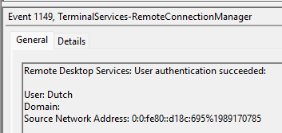

# SmartyPants

#### **Sherlock Scenario**

Forela's CTO, Dutch, stores important files on a separate Windows system because the domain environment at Forela is frequently breached due to its exposure across various industries. On 24 January 2025, our worst fears were realised when an intruder accessed the fileserver, installed utilities to aid their actions, stole critical files, and then deleted them, rendering them unrecoverable. The team was immediately informed of the extortion attempt by the intruders, who are now demanding money. While our legal team addresses the situation, we must quickly perform triage to assess the incident's extent. Note from the manager: We enabled SmartScreen Debug Logs across all our machines for enhanced visibility a few days ago, following a security research recommendation. These logs can provide quick insights, so ensure they are utilised.

- Microsoft Defender SmartScreen là công cụ bảo mật có sẵn trên windows có thể ngăn chặn những trang web và tệp tin độc hại.

> *Task 1: The attacker logged in to the machine where Dutch saves critical files, via RDP on 24th January 2025. Please determine the timestamp of this login.*
> 
- trong log security không có logon type 10 nên ta sẽ kiểm tra trong log Microsoft-Windows-TerminalServices-RemoteConnectionManager
- event id 1149 ghi nhận người dùng xác thực thành công

`2025-01-24 10:15:14`

> *Task 2: The attacker downloaded a few utilities that aided them for their sabotage and extortion operation. What was the first tool they downloaded and installed?*
> 
- kiểm tra Microsoft-Windows-SmartScreen/Debug

- attacker đã tải các công cụ lần lượt là WinRAR, Everything, MEGAsyncSetup64

`WinRAR`

> *Task 3: They then proceeded to download and then execute the portable version of a tool that could be used to search for files on the machine quickly and efficiently. What was the full path of the executable?*
> 

`C:\Users\Dutch\Downloads\Everything.exe` 

> *Task 4: What is the execution time of the tool from task 3?*
> 

`2025-01-24 10:17:33`

> *Task 5: The utility was used to search for critical and confidential documents stored on the host, which the attacker could steal and extort the victim. What was the first document that the attacker got their hands on and breached the confidentiality of that document?*
> 

`C:\Users\Dutch\Documents\2025- Board of directors Documents\Ministry Of Defense Audit.pdf`

> *Task 6: Find the name and path of second stolen document as well.*
> 

`C:\Users\Dutch\Documents\2025- Board of directors Documents\2025-BUDGET-ALLOCATION-CONFIDENTIAL.pdf`

> *Task 7: The attacker installed a Cloud utility as well to steal and exfiltrate the documents. What is name of the cloud utility?*
> 
- task 2 đã tìm ra 3 công cụ
- `MEGAsyncSetup64` là công cụ MEGAsync của MS có thể đồng bộ hóa và sao lưu dữ liệu lên cloud, attacker dùng nó để extrafil dữ liệu lên cloud của chúng.

> *Task 8: When was this utility executed?*
> 

- attacker dùng Everything để tìm kiếm các document, sau đó tải MEGAsync về, bước này chỉ để setup chứ chưa thực sự sử dụng.
- sau đó attacker mở cmd để thực hiện tạo và collection các document rồi zip lại bằng WinRAR
- cuối cùng là dùng MEGAsync để exfiltration.

> *Task 8: The Attacker also proceeded to destroy the data on the host so it is unrecoverable. What utility was used to achieve this?*
> 

- Shredder là công cụ để xóa vĩnh viễn dữ liệu khỏi ổ cứng của máy
- Shrerdder được tải về và tạo thành .lnk để đưa vào Start Menu, điều này sẽ khiến cho mỗi khi mở máy công cụ này sẽ được chạy và xóa toàn bộ dữ liệu.

`File Shredder`

> *Task 9: The attacker cleared 2 important logs, thinking they covered all their tracks. When was the security log cleared?*
> 

- attacker đã xóa log của Security và System

`2025-01-24 10:28:41`

| Event ID | Event Name  | Description |
| --- | --- | --- |
| 1149 | Remote Desktop Services: User authentication succeeded | RDP xác thực thành  |
| 1102 | The audit log was cleared | log Security bị xóa |
| 104 | The log file was cleared | log System bị xóa |

Mapping Mitre ATT&CK

| Tactic | ID | Technique | Detail |
| --- | --- | --- | --- |
| Initial Access | T1133 | External Remote Service | đăng nhập bằng  |
| Command and Control | T1105 | Ingress Tool Transfer | tải winrar, Everything, MEGAsync, File Shredder |
| Discovery | T1083 | File and Directory Discovery | dùng Everything để tìm file |
| Collection | T1005 | Data from Local System | thu thập các tài liệu quan trọng |
|  | T1074.001 | Data Staged: Local Data  | thu thập document rồi nén lại |
|  | T1560.001 | Archive Collected Data: Archive via Utility  | chạy winra sau khi thu thập dữ liệu |
| Exfiltration | T1567.002 | Exfiltration Over Web Service: Exfiltration Over Cloud Storage | chạy MEGAsync sau khi  |
| Impact | T1485 | Data Destruction | dùng File Shredder để xóa vĩnh viễn dữ liệu |
|   Defense Impairment | T1685.005 | Disable or Modify Tools: Clear Windows Event Logs | xóa log |