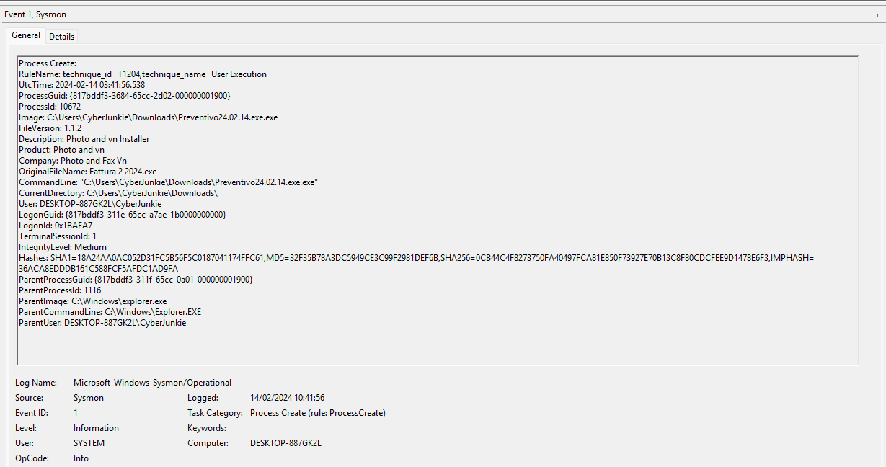

# Unit42

#### **Sherlock Scenario**

In this Sherlock, you will familiarize yourself with Sysmon logs and various useful EventIDs for identifying and analyzing malicious activities on a Windows system. Palo Alto's Unit42 recently conducted research on an UltraVNC campaign, wherein attackers utilized a backdoored version of UltraVNC to maintain access to systems. This lab is inspired by that campaign and guides participants through the initial access stage of the campaign.

> *Task 1: How many Event logs are there with Event ID 11?*
> 

`56` 

> *Task 2: Whenever a process is created in memory, an event with Event ID 1 is recorded with details such as command line, hashes, process path, parent process path, etc. This information is very useful for an analyst because it allows us to see all programs executed on a system, which means we can spot any malicious processes being executed. What is the malicious process that infected the victim's system?*
> 



- phát hiện Preventivo24.02.14.exe.exe đặt tên 2 lần .exe và tên gốc của nó là Fattura 2 2024.exe
- kiểm tra hash của file trên virus total thì nó là một malware Trojan.
- process 10672 đã tạo ra msiexec.exe, msiexec.exe là công cụ hợp pháp của windows để cài đặt các bản cập nhật của windows.


- lợi dụng msiexec.exe để chạy main1.msi

`C:\Users\CyberJunkie\Downloads\Preventivo24.02.14.exe.exe` 

> *Task 3: Which Cloud drive was used to distribute the malware?*
> 
- event 11 ghi nhận tải file `Preventivo24.02.14.exe.exe` vào lúc 2024-02-14 03:41:26 từ trình duyệt firefox.
- kiểm tra event 22 ghi nhận query tải file trực tiếp từ dropbox, dropbox là dịch vụ lưu trữ cloud dùng để lưu trữ, tải, chia sẻ tài liệu.


`dropbox` 

> *Task 4: For many of the files it wrote to disk, the initial malicious file used a defense evasion technique called Time Stomping, where the file creation date is changed to make it appear older and blend in with other files. What was the timestamp changed to for the PDF file?*
> 
- sysmon 2 ghi nhận Preventivo24.02.14.exe.exe thay đổi time của file ~.pdf


`2024-01-14 08:10:06`

> *Task 5: The malicious file dropped a few files on disk. Where was "once.cmd" created on disk? Please answer with the full path along with the filename.*
> 
- sysmon 11 ghi nhận file được tạo

`TargetFilename: C:\Users\CyberJunkie\AppData\Roaming\Photo and Fax Vn\Photo and vn 1.1.2\install\F97891C\WindowsVolume\Games\once.cmd` 

> Task 6: The malicious file attempted to reach a dummy domain, most likely to check the internet connection status. What domain name did it try to connect to?
> 
- sysmon 3 ghi nhận có kết nối mạng từ Preventivo24.02.14.exe.exe tới 93.184.216.34


- sysmon 22 ghi nhận kết nối tới [www.example.com](http://www.example.com) vào đúng thời gian kết nối mạng ở trên.


`www.example.com` 

> *Task 7: Which IP address did the malicious process try to reach out to?*
> 

`93.184.216.34` 

> *Task 8: The malicious process terminated itself after infecting the PC with a backdoored variant of UltraVNC. When did the process terminate itself?*
> 
- sysmon 5 ghi nhận process terminated


`2024-02-14 03:41:58`

---

#### Investigating Detail

- vào khoảng 2024-02-14 03:41:25.269 user CyberJunkie truy cập vào firefox từ máy DESKTOP-887GK2L và tải mã độc từ domain uc2f030016253ec53f4953980a4e.dl.dropboxusercontent.com, trang này thường là trang download của dropbox


- 2024-02-14 03:41:26
    
    sysmon 11 ghi nhận tải file
    
    TargetFilename: C:\Users\CyberJunkie\Downloads\Preventivo24.02.14.exe.exe
    
- 2024-02-14 03:41:56
    - pid: 10672 - Preventivo24.02.14.exe.exe
    - ppid: 1116 - Explorer.EXE
    - user: DESKTOP-887GK2L\CyberJunkie
    - Intergrity: medium
- 2024-02-14 03:41:57 ghi nhận tiến trình của Windows Installer chạy lệnh thực thi main1.msi
    - process:  10324 - "C:\Windows\system32\msiexec.exe"
    - pp: 10672
    
    ```jsx
    "C:\Windows\system32\msiexec.exe" /i "C:\Users\CyberJunkie\AppData\Roaming\Photo and Fax Vn\Photo and vn 1.1.2\install\F97891C\main1.msi" AI_SETUPEXEPATH=C:\Users\CyberJunkie\Downloads\Preventivo24.02.14.exe.exe SETUPEXEDIR=C:\Users\CyberJunkie\Downloads\ EXE_CMD_LINE="/exenoupdates  /forcecleanup  /wintime 1707880560  " AI_EUIMSI=""
    ```
    

⇒ người dùng click chạy Preventivo24.02.14.exe.exe từ explorer

- 2024-02-14 03:41:58 ngay sau đó sysmon ghi nhận kết nối internet
    - SourceIp: 172.17.79.132
    - DestinationIp: 93.184.216.34
    - QueryName: www.example.com
- sau đó sysmon 2 ghi nhận Preventivo24.02.14.exe.exe đổi thời gian tạo của hàng loạt các file về 1 tháng trước


- ghi nhận msiexec.exe và Preventivo24.02.14.exe.exe tải hàng loạt các file
    
    ```jsx
    TargetFilename: C:\Windows\Installer\17c5a1.msi
    TargetFilename: C:\Windows\Installer\17c5a1.msi
    TargetFilename: C:\Windows\Installer\MSIC61E.tmp
    TargetFilename: C:\Windows\Installer\MSIC64E.tmp
    TargetFilename: C:\Windows\Installer\MSIC65F.tmp
    TargetFilename: C:\Windows\Installer\MSIC670.tmp
    TargetFilename: C:\Windows\Installer\MSIC690.tmp
    TargetFilename: C:\Windows\Installer\MSIC6C0.tmp
    TargetFilename: C:\Users\CyberJunkie\AppData\Roaming\Photo and Fax Vn\Photo and vn 1.1.2\install\F97891C\WindowsVolume\Games\c.cmd
    TargetFilename: C:\Users\CyberJunkie\AppData\Roaming\Photo and Fax Vn\Photo and vn 1.1.2\install\F97891C\WindowsVolume\Games\cmmc.cmd
    TargetFilename: C:\Users\CyberJunkie\AppData\Roaming\Photo and Fax Vn\Photo and vn 1.1.2\install\F97891C\WindowsVolume\Games\on.cmd
    TargetFilename: C:\Users\CyberJunkie\AppData\Roaming\Photo and Fax Vn\Photo and vn 1.1.2\install\F97891C\WindowsVolume\Games\once.cmd
    TargetFilename: C:\Users\CyberJunkie\AppData\Roaming\Photo and Fax Vn\Photo and vn 1.1.2\install\F97891C\WindowsVolume\Games\taskhost.exe
    TargetFilename: C:\Users\CyberJunkie\AppData\Roaming\Photo and Fax Vn\Photo and vn 1.1.2\install\F97891C\WindowsVolume\Games\viewer.exe
    TargetFilename: C:\Games\on.cmd
    TargetFilename: C:\Games\c.cmd
    TargetFilename: C:\Games\cmmc.cmd
    TargetFilename: C:\Games\viewer.exe
    TargetFilename: C:\Games\once.cmd
    TargetFilename: C:\Games\taskhost.exe
    ```
    
- có sự xuất hiện của taskhost.exe nhưng chưa ghi nhận được nó được thực thi
- 2024-02-14 03:41:58 ghi nhận Process Terminated của Preventivo24.02.14.exe.exe

---

#### Mapping Mitre

| Tactic | ID | Technique | Detail |
| --- | --- | --- | --- |
| Defense Evasion | T121.007 | System Binary Proxy Execution: Msiexec | Preventivo24.02.14.exe.exe tạo ra msiexec.exe |
|  | T1070.006 | Indicator Removal: Timestomp | thay đổi thời gian tải file |
|  | T1036.007 | Masquerading: Double File Extention | .exe.exe, original file name khác file name thực  |
| Execution | T1204.002 | User Execution: Malicious File | Explorer.exe → Preventivo24.02.14.exe.exe |